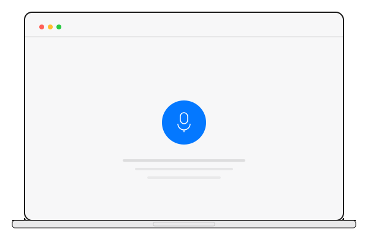

# Voice Aura — Asset & Resource Guidelines

> A complete reference for icons, illustrations, patterns, fonts, and visual assets used in the Voice Aura design system — including where to source them, how to prepare them, and when to use each type.

---

## Table of Contents

1. [Asset Directory Structure](#asset-directory-structure)
2. [Icons](#icons)
3. [Brand Assets](#brand-assets)
4. [Patterns & Decorative Elements](#patterns--decorative-elements)
5. [Illustrations & Mockups](#illustrations--mockups)
6. [Typography & Fonts](#typography--fonts)
7. [Open-Source Platforms & Sources](#open-source-platforms--sources)
8. [Asset Sourcing Workflow](#asset-sourcing-workflow)
9. [File Format & Optimization Guidelines](#file-format--optimization-guidelines)
10. [Naming Conventions](#naming-conventions)
11. [Color Application for Assets](#color-application-for-assets)
12. [Sizing & Spacing Guidelines](#sizing--spacing-guidelines)
13. [Accessibility](#accessibility)
14. [Performance Considerations](#performance-considerations)
15. [Licensing Summary](#licensing-summary)

---

## Asset Directory Structure

```
assets/
├── brand/
│   ├── logo-icon.svg           # Logo mark (sound-wave icon)
│   ├── logo-icon-white.svg     # Logo mark (white, for dark backgrounds)
│   └── logo-full.svg           # Full logo (icon + "Voice Aura" text)
├── icons/
│   ├── lucide/                 # Lucide icon set (MIT license)
│   │   ├── mic.svg
│   │   ├── headphones.svg
│   │   ├── play.svg
│   │   └── ... (54 curated icons)
│   ├── play-circle.svg         # Custom play button
│   ├── pause-circle.svg        # Custom pause button
│   ├── waveform.svg            # Custom waveform icon
│   ├── microphone.svg          # Custom mic icon
│   └── volume-high.svg         # Custom volume icon
├── patterns/
│   ├── halftone-dots.svg       # Repeating halftone tile (16x16)
│   ├── grid-dots.svg           # Repeating dot grid tile (24x24)
│   ├── sound-wave-hero.svg     # Decorative hero waveform
│   └── wave-divider.svg        # Horizontal section divider
└── illustrations/
    ├── voice-studio-mockup.svg # Browser/laptop frame mockup
    └── phone-mockup.svg        # Phone frame mockup
```

---

## Icons

### Primary Library: Lucide Icons

Lucide is the recommended icon library for Voice Aura. It provides clean, minimal, stroke-based icons that perfectly match the design system aesthetic.

| Property | Detail |
|----------|--------|
| **Library** | [Lucide Icons](https://lucide.dev/) |
| **License** | MIT (free for commercial use, no attribution required) |
| **Style** | Outline / stroke-based |
| **Default Size** | 24x24 viewBox |
| **Stroke Width** | 2px (default), adjustable |
| **Icon Count** | 1,900+ |
| **Installed via** | `npm install lucide-static` (already in devDependencies) |

### Installation & Usage

#### Option A: Direct SVG (Recommended for Static Sites)

Copy SVGs from `assets/icons/lucide/` or from `node_modules/lucide-static/icons/`:

```html
<!-- Inline SVG (best for styling control) -->
<svg class="va-icon" width="24" height="24" viewBox="0 0 24 24"
     fill="none" stroke="currentColor" stroke-width="2"
     stroke-linecap="round" stroke-linejoin="round">
  <path d="M12 2a3 3 0 0 0-3 3v7a3 3 0 0 0 6 0V5a3 3 0 0 0-3-3Z"/>
  <path d="M19 10v2a7 7 0 0 1-14 0v-2"/>
  <line x1="12" y1="19" x2="12" y2="22"/>
</svg>
```

#### Option B: CDN (Quick Prototyping)

```html
<script src="https://unpkg.com/lucide@latest"></script>
<script>lucide.createIcons();</script>

<!-- Then use data attributes -->
<i data-lucide="mic" class="va-icon"></i>
<i data-lucide="headphones" class="va-icon"></i>
<i data-lucide="send" class="va-icon"></i>
```

#### Option C: React / Vue / Svelte

```bash
npm install lucide-react    # React
npm install lucide-vue-next # Vue 3
npm install lucide-svelte   # Svelte
```

```jsx
import { Mic, Headphones, Send, Settings } from 'lucide-react';

<Mic size={24} color="#1A1919" strokeWidth={1.5} />
<Send size={24} color="#0478FF" strokeWidth={1.5} />
```

### Icon Styling Classes

```scss
// Standard icon
.va-icon {
  width: 24px;
  height: 24px;
  stroke: $va-near-black;
  stroke-width: 1.5;
  fill: none;
  flex-shrink: 0;
}

// Size variants
.va-icon--sm { width: 16px; height: 16px; }
.va-icon--lg { width: 32px; height: 32px; }
.va-icon--xl { width: 48px; height: 48px; }

// Color variants
.va-icon--primary { stroke: $va-primary-blue; }
.va-icon--muted   { stroke: $va-muted-text; }
.va-icon--white   { stroke: $va-white; }

// Filled variant (for solid icons)
.va-icon--filled {
  fill: currentColor;
  stroke: none;
}
```

### Curated Icon Map

These 54 Lucide icons are pre-selected for Voice Aura and saved in `assets/icons/lucide/`:

| Category | Icons |
|----------|-------|
| **Audio/Voice** | `mic`, `mic-off`, `headphones`, `volume-2`, `volume-x`, `audio-waveform`, `podcast`, `radio`, `speaker`, `waves` |
| **Playback** | `play`, `pause`, `square` (stop), `circle-play`, `circle-pause` |
| **Navigation** | `menu`, `x`, `search`, `arrow-right`, `chevron-down`, `chevron-right`, `chevron-up`, `external-link` |
| **Actions** | `send`, `upload`, `download`, `copy`, `share-2`, `bookmark`, `log-in`, `log-out` |
| **Content** | `file-text`, `code`, `globe`, `languages`, `video`, `message-square` |
| **Feedback** | `heart`, `star`, `thumbs-up`, `check`, `bell`, `eye`, `eye-off` |
| **Utility** | `settings`, `user`, `lock`, `mail`, `phone`, `clock`, `zap`, `sparkles` |
| **Commerce** | `credit-card`, `shield-check` |
| **Social** | `github`, `twitter` |

### Secondary Library: Phosphor Icons (Optional)

Use Phosphor only when Lucide lacks a specific icon. Phosphor's "Thin" weight best matches Voice Aura.

```bash
npm install @phosphor-icons/web
```

```html
<i class="ph-thin ph-waveform"></i>
```

| Property | Detail |
|----------|--------|
| **Library** | [Phosphor Icons](https://phosphoricons.com/) |
| **License** | MIT |
| **Recommended Weight** | Thin (1px) or Light (1.5px) |
| **Icon Count** | 8,000+ |

---

## Brand Assets

### Logo Mark (`logo-icon.svg`)

The Voice Aura logo mark consists of a circle with concentric sound-wave arcs emanating to the right. It symbolizes voice generation and audio output.

| Property | Value |
|----------|-------|
| **File** | `assets/brand/logo-icon.svg` |
| **ViewBox** | `0 0 48 48` |
| **Primary Color** | `#0478FF` (circle) |
| **Arc Color** | `#1A1919` (arcs with decreasing opacity) |
| **Min Display Size** | 24x24 px |

#### Usage Rules

- **Do** use the logo mark in the navbar at 32x32 or 40x40 px.
- **Do** use the white variant (`logo-icon-white.svg`) on dark backgrounds.
- **Do** maintain at least 8px clear space around the logo mark.
- **Don't** stretch, rotate, or apply effects to the logo.
- **Don't** recolor the logo outside the defined brand colors.

### Full Logo (`logo-full.svg`)

The full logo combines the icon with "Voice Aura" text set in IBM Plex Serif SemiBold. "Voice" is in near-black, "Aura" is in primary blue.

| Property | Value |
|----------|-------|
| **File** | `assets/brand/logo-full.svg` |
| **ViewBox** | `0 0 200 48` |
| **Min Display Width** | 140px |
| **Font** | IBM Plex Serif, 600 weight |

---

## Patterns & Decorative Elements

### Built-In CSS Patterns (No External Files Needed)

The design system includes two SCSS-based decorative patterns. These are generated with pure CSS and require no image assets.

#### 1. Halftone Dot Overlay

Subtle dot pattern that adds texture to sections and hero areas.

```scss
// Apply to any container element
.my-section {
  @include va-halftone-overlay($opacity: 0.06, $color: $va-near-black);
}
```

| Property | Value |
|----------|-------|
| **Mixin** | `va-halftone-overlay()` |
| **Default Opacity** | `0.06` |
| **Dot Size** | 1px radius |
| **Grid Spacing** | 8px |
| **Location** | `scss/abstracts/_mixins.scss` |

#### 2. Animated Sound Wave Bars

Vertical bars that pulse with staggered timing, used in the hero section flanks.

```html
<div class="va-hero__wave va-hero__wave--left">
  <span class="va-hero__wave-bar"></span>
  <span class="va-hero__wave-bar"></span>
  <!-- 8 bars total -->
</div>
```

| Property | Value |
|----------|-------|
| **Bar Width** | 3px |
| **Bar Color** | `#0478FF` |
| **Bar Count** | 8 per side |
| **Animation** | `va-wave-pulse`, 1.4s alternate |
| **Location** | `scss/layout/_hero.scss` |

### SVG Pattern Tiles

For non-CSS contexts (email, static images, exports), use the SVG pattern tiles:

| Pattern | File | Tile Size | Usage |
|---------|------|-----------|-------|
| Halftone Dots | `assets/patterns/halftone-dots.svg` | 16x16 | `background-image` repeat |
| Grid Dots | `assets/patterns/grid-dots.svg` | 24x24 | `background-image` repeat |
| Sound Wave | `assets/patterns/sound-wave-hero.svg` | 120x300 | Hero flanking decoration |
| Wave Divider | `assets/patterns/wave-divider.svg` | 1440x60 | Horizontal section separator |

#### Using SVG Pattern Tiles

```css
/* Repeating halftone background */
.section-textured {
  background-image: url('../assets/patterns/halftone-dots.svg');
  background-repeat: repeat;
  background-size: 16px 16px;
}

/* Section divider */
.section-divider {
  width: 100%;
  height: 60px;
  background-image: url('../assets/patterns/wave-divider.svg');
  background-size: 100% 100%;
  background-repeat: no-repeat;
}
```

---

## Illustrations & Mockups

### Custom Mockups

| Asset | File | ViewBox | Usage |
|-------|------|---------|-------|
| Browser/Laptop Frame | `assets/illustrations/voice-studio-mockup.svg` | `600x400` | Feature sections, demos |
| Phone Frame | `assets/illustrations/phone-mockup.svg` | `280x560` | Mobile app showcase |

#### Usage

```html
<div class="va-feature-row__visual">
  
</div>
```

### Open-Source Illustration Sources

For additional illustrations (feature pages, empty states, onboarding, error pages), use these platforms:

#### 1. unDraw (Recommended)

| Property | Detail |
|----------|--------|
| **URL** | [undraw.co](https://undraw.co/) |
| **License** | CC0 1.0 (Public Domain) |
| **Attribution** | Not required |
| **Commercial Use** | Yes |
| **Format** | SVG, PNG |
| **Color Customization** | Set accent color to `#0478FF` before downloading |

**Best search terms:** `sound`, `audio`, `voice`, `music`, `recording`, `podcast`, `wave`, `broadcast`

**How to use:**
1. Visit undraw.co
2. Set the accent color to `#0478FF` using the color picker
3. Search for the illustration you need
4. Download as SVG
5. Save to `assets/illustrations/`
6. Edit the SVG to replace any remaining off-brand colors

#### 2. Freepik

| Property | Detail |
|----------|--------|
| **URL** | [freepik.com](https://www.freepik.com/) |
| **License** | Free tier requires attribution; Premium tier does not |
| **Attribution** | **Required for free assets** — add to footer or credits page |
| **Commercial Use** | Yes (both free and premium) |
| **Format** | SVG, AI, EPS, PNG, PSD |
| **Best For** | Polished illustrations, flat vectors, background patterns, stock photos |

**Best search terms:** `audio waveform flat`, `voice assistant minimal`, `podcast illustration flat`, `sound wave pattern`, `microphone line art`, `speech bubble flat`

**How to use:**
1. Search freepik.com and filter by **Free** and **Vectors** (for SVG/AI)
2. Download the asset and check the license on the download page
3. Open in a vector editor (Figma, Illustrator, or Inkscape)
4. Recolor to Voice Aura palette (see [Color Application](#color-application-for-assets))
5. Export as optimized SVG
6. Save to `assets/illustrations/` or `assets/patterns/`
7. **If free license:** Add attribution (e.g., `Designed by [author] / Freepik`) to your project credits

> **Attribution format for free Freepik assets:**
> ```html
> <!-- In footer or credits page -->
> <a href="https://www.freepik.com">Designed by [AuthorName] / Freepik</a>
> ```

#### 3. Flaticon (by Freepik — Icon-Specific)

| Property | Detail |
|----------|--------|
| **URL** | [flaticon.com](https://www.flaticon.com/) |
| **License** | Free with attribution; Premium without |
| **Attribution** | **Required for free icons** |
| **Commercial Use** | Yes |
| **Format** | SVG, PNG, EPS, PSD |
| **Best For** | Specialized icons not found in Lucide (e.g., language flags, industry-specific icons) |

**When to use Flaticon over Lucide:**
- You need a very specific icon that Lucide/Phosphor lack (e.g., a dubbing icon, a specific flag)
- You need filled/colored icons for marketing pages (not app UI)
- The icon will be used decoratively, not as a core UI element

**How to use:**
1. Search flaticon.com and filter by **Free** and **SVG**
2. Prefer **Outline** or **Linear** style to match Lucide
3. Download SVG and recolor strokes to `#1A1919` or `currentColor`
4. Set stroke-width to `1.5` or `2` to match Lucide consistency
5. Save to `assets/icons/` with a descriptive name
6. Add attribution if using the free license

#### 4. Storyset (by Freepik — Animated Illustrations)

| Property | Detail |
|----------|--------|
| **URL** | [storyset.com](https://storyset.com/) |
| **License** | Free with attribution |
| **Attribution** | Required — link to Storyset |
| **Commercial Use** | Yes |
| **Format** | SVG (static and animated) |
| **Best For** | Onboarding flows, empty states, error pages, marketing pages |

**Best search terms:** `podcast`, `voice`, `audio`, `technology`, `recording`

**How to use:**
1. Search storyset.com and pick a style: **Pana** (soft), **Bro** (bold), or **Amico** (minimal)
2. Customize the primary color to `#0478FF`
3. Toggle layers on/off for simplicity
4. Download static SVG or animated SVG
5. Save to `assets/illustrations/`
6. For animated versions, embed the `<svg>` inline in your HTML

#### 5. SVG Repo

| Property | Detail |
|----------|--------|
| **URL** | [svgrepo.com](https://www.svgrepo.com/) |
| **License** | Varies per asset (CC0, MIT, custom) — check each |
| **Attribution** | Usually not required (verify per asset) |
| **Commercial Use** | Most are free for commercial use |
| **Format** | SVG |

**Best search terms:** `waveform`, `audio`, `microphone`, `equalizer`, `monochrome`, `minimal`

**How to use:**
1. Search and filter by "Monochrome" style
2. Download SVG
3. Recolor paths to use Voice Aura brand colors
4. Save to `assets/illustrations/` or `assets/icons/`

#### 6. Hero Patterns (Background Patterns)

| Property | Detail |
|----------|--------|
| **URL** | [heropatterns.com](https://heropatterns.com/) |
| **License** | Free for personal and commercial use |
| **Attribution** | Not required |
| **Format** | CSS / inline SVG |

**Recommended patterns:** Topography, Wiggle, I Like Food (dot grid), Charlie Brown (diagonal lines)

**How to use:**
1. Choose a pattern on heropatterns.com
2. Set the foreground color to `#1A1919` and opacity to 0.03-0.06
3. Copy the CSS
4. Apply as a background to your section element

#### 7. Heroicons

| Property | Detail |
|----------|--------|
| **URL** | [heroicons.com](https://heroicons.com/) |
| **License** | MIT |
| **Attribution** | Not required |
| **Commercial Use** | Yes |
| **Format** | SVG (Outline, Solid, Mini variants) |
| **Best For** | Clean UI icons with a slightly bolder feel than Lucide |

**When to use Heroicons over Lucide:**
- Only when Lucide and Phosphor lack a specific icon
- Prefer the **Outline** variant (24x24) to match Voice Aura's stroke-based style
- Heroicons use `stroke-width="1.5"` by default, which matches Voice Aura's preferred weight

```bash
npm install @heroicons/react   # React
```

```html
<!-- Direct SVG (outline variant) -->
<svg xmlns="http://www.w3.org/2000/svg" fill="none" viewBox="0 0 24 24"
     stroke-width="1.5" stroke="currentColor" class="va-icon">
  <path stroke-linecap="round" stroke-linejoin="round" d="M..."/>
</svg>
```

#### 8. Tabler Icons

| Property | Detail |
|----------|--------|
| **URL** | [tabler.io/icons](https://tabler.io/icons) |
| **License** | MIT |
| **Attribution** | Not required |
| **Commercial Use** | Yes |
| **Icon Count** | 5,800+ |
| **Format** | SVG |
| **Best For** | Largest MIT-licensed collection; fallback for rare icons |

**When to use:** Only when Lucide, Phosphor, and Heroicons all lack the specific icon you need.

#### 9. OpenPeeps (Hand-Drawn People Illustrations)

| Property | Detail |
|----------|--------|
| **URL** | [openpeeps.com](https://www.openpeeps.com/) |
| **License** | CC0 (Public Domain) |
| **Attribution** | Not required |
| **Commercial Use** | Yes |
| **Format** | SVG, PNG |
| **Best For** | Testimonial sections, team pages, about pages, user avatars |

**How to use:**
1. Download the library from openpeeps.com
2. Mix and match heads, bodies, and accessories in Figma
3. Export as SVG
4. Recolor strokes to `#1A1919` for consistency

---

## Typography & Fonts

### Font Family: IBM Plex

Voice Aura uses the IBM Plex superfamily exclusively. All weights are available from Google Fonts under the **SIL Open Font License (OFL)**.

| Font | Usage | Weights | Source |
|------|-------|---------|--------|
| **IBM Plex Serif** | Headings, display text | 400, 500, 600, 700 | [Google Fonts](https://fonts.google.com/specimen/IBM+Plex+Serif) |
| **IBM Plex Sans** | Body text, UI labels | 300, 400, 500, 600, 700 | [Google Fonts](https://fonts.google.com/specimen/IBM+Plex+Sans) |
| **IBM Plex Mono** | Code blocks, API keys | 400, 500 | [Google Fonts](https://fonts.google.com/specimen/IBM+Plex+Mono) |

### Loading Fonts

#### Option A: Google Fonts CDN (Easiest)

```html
<link rel="preconnect" href="https://fonts.googleapis.com">
<link rel="preconnect" href="https://fonts.gstatic.com" crossorigin>
<link href="https://fonts.googleapis.com/css2?family=IBM+Plex+Mono:wght@400;500&family=IBM+Plex+Sans:wght@300;400;500;600;700&family=IBM+Plex+Serif:wght@400;500;600;700&display=swap" rel="stylesheet">
```

#### Option B: Self-Hosted (Best Performance)

1. Download fonts from [Google Fonts](https://fonts.google.com/) or [github.com/IBM/plex](https://github.com/IBM/plex)
2. Place in `assets/fonts/`
3. Use `@font-face` declarations:

```scss
@font-face {
  font-family: 'IBM Plex Sans';
  src: url('../assets/fonts/IBMPlexSans-Regular.woff2') format('woff2');
  font-weight: 400;
  font-style: normal;
  font-display: swap;
}
```

#### Option C: npm Package

```bash
npm install @ibm/plex
```

```scss
@import '@ibm/plex/scss/ibm-plex';
```

### Font Files Source

| Source | URL | License |
|--------|-----|---------|
| Google Fonts | `fonts.google.com` | SIL Open Font License 1.1 |
| IBM GitHub Repo | `github.com/IBM/plex` | SIL Open Font License 1.1 |
| npm | `@ibm/plex` | SIL Open Font License 1.1 |

### Font Usage Rules

- **Headings (h1–h4):** IBM Plex Serif, SemiBold (600) or Bold (700)
- **Subheadings (h5–h6):** IBM Plex Sans, SemiBold (600)
- **Body text:** IBM Plex Sans, Regular (400)
- **Buttons & labels:** IBM Plex Sans, Medium (500) or SemiBold (600)
- **Code snippets:** IBM Plex Mono, Regular (400)
- **Never** mix other typefaces into the Voice Aura design system.

---

## Open-Source Platforms & Sources

### Icon Platform Hierarchy

Use these platforms in order of preference when looking for icons:

| Priority | Platform | License | Icon Count | Style Match |
|----------|----------|---------|------------|-------------|
| 1 | **Lucide** | ISC/MIT | 1,600+ | Exact match (primary library) |
| 2 | **Phosphor** | MIT | 9,000+ | Very close (weight variants) |
| 3 | **Heroicons** | MIT | 300+ | Close (stroke-width: 1.5) |
| 4 | **Tabler Icons** | MIT | 5,800+ | Good (stroke-width: 2) |
| 5 | **Flaticon** | Free+attribution | Millions | Varies — filter for outline/linear |

### Illustration Platform Hierarchy

| Priority | Platform | License | Best For |
|----------|----------|---------|----------|
| 1 | **unDraw** | CC0 | Feature illustrations, empty states |
| 2 | **Storyset** | Free+attribution | Animated illustrations, onboarding |
| 3 | **OpenPeeps** | CC0 | People illustrations, testimonials |
| 4 | **Freepik** | Free+attribution | Polished vectors, marketing |
| 5 | **SVG Repo** | Varies | Miscellaneous SVG assets |

### Photo & Image Sources

| Platform | License | Best For |
|----------|---------|----------|
| **Unsplash** | Free (custom) | Hero backgrounds, editorial photos |
| **Pexels** | Free (custom) | Alternative stock photos |
| **Pixabay** | Free (custom) | Icons, vectors, and photos |

> All three platforms allow free commercial use without attribution, but crediting the photographer is appreciated.

---

## Asset Sourcing Workflow

Follow this step-by-step process when adding any new asset to the design system:

### Step 1: Check Existing Assets First

```
assets/icons/      → Do we already have this icon?
assets/patterns/   → Do we already have this pattern?
assets/illustrations/ → Do we already have this illustration?
```

### Step 2: Search Primary Sources

Use the [Icon Platform Hierarchy](#icon-platform-hierarchy) or [Illustration Platform Hierarchy](#illustration-platform-hierarchy) above.

### Step 3: Verify the License

Before downloading, confirm the license:

| License Type | Can Use? | Attribution? | Notes |
|--------------|----------|--------------|-------|
| CC0 / Public Domain | Yes | No | Best option |
| MIT / ISC | Yes | No | Include license file if redistributing |
| Apache 2.0 | Yes | No | Include NOTICE file if redistributing |
| SIL OFL 1.1 | Yes (fonts) | No (usage) | Cannot sell font files alone |
| CC BY 4.0 | Yes | **Yes** | Must credit author |
| Freepik Free | Yes | **Yes** | Must link to Freepik |
| GPL | Caution | Yes | May affect project license — avoid if possible |
| No license stated | **No** | — | Do not use without written permission |

### Step 4: Download & Prepare

1. **Download** the asset in SVG format when possible
2. **Open** in a text editor or vector tool
3. **Clean up** the SVG:
   - Remove unnecessary metadata, comments, and editor artifacts
   - Remove `width` and `height` attributes (use `viewBox` instead)
   - Remove inline `style` elements — use classes or attributes
4. **Recolor** to match the Voice Aura palette (see [Color Application](#color-application-for-assets))
5. **Optimize** the SVG (see [File Format & Optimization](#file-format--optimization-guidelines))

### Step 5: Save & Document

1. Save to the correct directory (see [Asset Directory Structure](#asset-directory-structure))
2. Follow [Naming Conventions](#naming-conventions)
3. If the asset requires attribution, add it to the project's attribution file or credits section

### Step 6: Test

1. Verify the asset renders correctly in the browser
2. Check accessibility (alt text, aria-labels)
3. Test at different sizes and on different backgrounds
4. Verify `prefers-reduced-motion` if the asset is animated

---

## File Format & Optimization Guidelines

### Choosing the Right Format

| Format | Use Case | Advantages | Disadvantages |
|--------|----------|------------|---------------|
| **SVG** | Icons, logos, patterns, illustrations | Scalable, small size, CSS-styleable | Complex images can be large |
| **WebP** | Photos, complex images | 25-35% smaller than JPEG | Not editable as vector |
| **PNG** | Screenshots, images needing transparency | Lossless, wide support | Larger file size |
| **JPEG** | Hero backgrounds, large photos | Small file size | No transparency, lossy |
| **AVIF** | Next-gen photo format | 50% smaller than JPEG | Limited browser support |
| **WOFF2** | Web fonts | Best compression for fonts | Font-specific format |

### SVG Optimization

Always optimize SVGs before adding them to the project:

**Using SVGO (recommended):**

```bash
# Install
npm install -g svgo

# Optimize a single file
svgo input.svg -o output.svg

# Optimize all SVGs in a directory
svgo -f assets/icons/ -o assets/icons/

# With custom config (preserve viewBox, remove dimensions)
svgo input.svg -o output.svg --config='{ "plugins": [
  { "name": "removeViewBox", "active": false },
  { "name": "removeDimensions", "active": true }
]}'
```

**Using SVGOMG (browser-based):**
- Visit [jakearchibald.github.io/svgomg/](https://jakearchibald.github.io/svgomg/)
- Paste or upload your SVG
- Toggle options (keep viewBox, remove dimensions, precision 2)
- Download the optimized SVG

### SVG Best Practices

```xml
<!-- Good: Uses viewBox, no fixed dimensions, currentColor -->
<svg xmlns="http://www.w3.org/2000/svg" viewBox="0 0 24 24"
     fill="none" stroke="currentColor" stroke-width="2"
     stroke-linecap="round" stroke-linejoin="round">
  <path d="M12 1a3 3 0 0 0-3 3v8a3 3 0 0 0 6 0V4a3 3 0 0 0-3-3z"/>
</svg>

<!-- Bad: Fixed dimensions, hardcoded colors, inline styles -->
<svg xmlns="http://www.w3.org/2000/svg" width="24" height="24">
  <path style="fill: #000000;" d="M12 1a3 3 0 0 0-3 3v8..."/>
</svg>
```

### Image Optimization

For raster images (photos, screenshots):

```bash
# Convert to WebP (using cwebp)
cwebp -q 80 input.png -o output.webp

# Responsive images in HTML
<picture>
  <source srcset="hero.avif" type="image/avif">
  <source srcset="hero.webp" type="image/webp">
  
</picture>
```

---

## Naming Conventions

### File Naming Rules

| Asset Type | Pattern | Example |
|------------|---------|---------|
| Lucide icons | `{icon-name}.svg` | `microphone.svg` |
| Custom icons | `{descriptive-name}.svg` | `waveform-pulse.svg` |
| Brand logos | `logo-{variant}.svg` | `logo-horizontal.svg` |
| Patterns | `{pattern-name}.svg` | `halftone-dots.svg` |
| Illustrations | `{scene-description}.svg` | `voice-studio-mockup.svg` |
| Photos | `{subject}-{size}.{ext}` | `hero-background-1200.webp` |

### General Rules

- Use **lowercase** and **kebab-case** (hyphens, not underscores)
- Be **descriptive** — `audio-waveform.svg` not `icon1.svg`
- Include **variant** in the name when applicable — `logo-dark.svg`, `logo-light.svg`
- Do **not** include size in icon names (size is controlled via CSS)
- Do **not** include color in the name (color is applied via CSS)

### Directory Placement

```
assets/
├── brand/           ← Logos, wordmarks, brand marks
├── fonts/           ← Self-hosted font files (WOFF2)
├── icons/
│   ├── lucide/      ← Icons from Lucide library
│   └── (root)       ← Custom icons, third-party icons
├── illustrations/   ← Scene illustrations, mockups, diagrams
└── patterns/        ← Background patterns, textures, dividers
```

---

## Color Application for Assets

### Recoloring Downloaded SVGs

When downloading SVGs from external sources, recolor them to match the Voice Aura palette:

```
Primary accent:     #0478FF  (interactive elements, highlights)
Primary dark:       #1A1919  (outlines, primary fills)
Secondary grey:     #E9E9EA  (subtle fills, borders)
Background alt:     #F7F7F8  (light fills)
Body text:          #4B5563  (secondary text in illustrations)
Muted:              #9CA3AF  (tertiary elements)
White:              #FFFFFF  (backgrounds, negative space)
```

### CSS Recoloring Techniques

```scss
// Method 1: currentColor (best for inline SVGs)
.va-icon {
  color: $va-near-black;
  // SVG uses stroke="currentColor" or fill="currentColor"
}

// Method 2: CSS filter (for  tags)
.va-illustration--monochrome {
  filter: grayscale(100%) brightness(0.1);
}

.va-illustration--blue {
  filter: grayscale(100%) brightness(0.5) sepia(1) hue-rotate(190deg) saturate(5);
}

// Method 3: Direct SVG path editing
// Open the SVG file and replace fill/stroke values:
//   fill="#6c63ff" → fill="#0478FF"
//   fill="#3f3d56" → fill="#1A1919"
```

---

## Sizing & Spacing Guidelines

### Icon Sizes

| Context | Size | Class |
|---------|------|-------|
| Inline with text | 16px | `.va-icon--sm` |
| Buttons, nav items | 20px | `.va-icon` (adjusted) |
| Standard UI | 24px | `.va-icon` (default) |
| Feature highlights | 32px | `.va-icon--lg` |
| Hero / marketing | 48px | `.va-icon--xl` |
| Large decorative | 64px+ | Custom sizing |

### Icon Spacing

- **Inside buttons:** 8px gap between icon and text
- **In lists:** 12px gap between icon and label
- **In nav items:** 8px gap
- **Standalone:** Centered in their container with min 8px padding

### Illustration Sizes

| Context | Max Width | Aspect Ratio |
|---------|-----------|--------------|
| Hero section | 600px | Flexible |
| Feature row visual | 500px | ~3:2 |
| Card illustration | 280px | ~1:1 or ~4:3 |
| Empty state | 240px | ~1:1 |
| Inline decorative | 120px | Flexible |

### Pattern Tile Sizes

| Pattern | Tile Size | Recommended Scale |
|---------|-----------|-------------------|
| Halftone dots | 16x16 | 1x (16px repeat) |
| Grid dots | 24x24 | 1x (24px repeat) |
| Sound wave hero | 120x300 | 1x |
| Wave divider | 1440x60 | `width: 100%` |

---

## Accessibility

### Icon Accessibility

```html
<!-- Decorative icon (hidden from screen readers) -->
<svg class="va-icon" aria-hidden="true" focusable="false">...</svg>

<!-- Meaningful icon (with accessible label) -->
<svg class="va-icon" role="img" aria-label="Microphone">
  <title>Microphone</title>
  ...
</svg>

<!-- Icon button -->
<button class="va-btn" aria-label="Play audio">
  <svg class="va-icon" aria-hidden="true">...</svg>
</button>
```

### Illustration Accessibility

```html
<!-- Decorative illustration -->


<!-- Meaningful illustration -->

```

### Color Contrast

- All icon strokes meet **WCAG AA** contrast ratio (4.5:1 min) against their backgrounds.
- `#1A1919` on `#FFFFFF` = 17.4:1 contrast ratio (AAA)
- `#0478FF` on `#FFFFFF` = 4.6:1 contrast ratio (AA)
- `#9CA3AF` on `#FFFFFF` = 2.9:1 — use only for decorative, non-essential elements.

---

## Performance Considerations

### Icon Loading Strategy

| Method | Best For | Performance |
|--------|----------|-------------|
| **Inline SVG** | Icons that need CSS styling, interactive icons | Best — no HTTP request |
| **SVG sprite** | Pages with many repeated icons | Good — single HTTP request |
| **`` tag** | Decorative illustrations | Good — cacheable, lazy-loadable |
| **CSS `background-image`** | Patterns, textures | Good — cacheable |
| **Icon font** | Not recommended | Poor — loads all icons regardless of usage |

### Lazy Loading

```html
<!-- Lazy-load illustrations below the fold -->


<!-- Eagerly load hero/above-the-fold images -->

```

### Font Loading Performance

```html
<!-- Preconnect to Google Fonts (already in sample.html) -->
<link rel="preconnect" href="https://fonts.googleapis.com">
<link rel="preconnect" href="https://fonts.gstatic.com" crossorigin>

<!-- Use font-display: swap to avoid FOIT (Flash of Invisible Text) -->
```

When self-hosting fonts, use `font-display: swap` in all `@font-face` declarations to ensure text remains visible while fonts load.

### Size Budgets

| Asset Type | Max Size | Notes |
|------------|----------|-------|
| Individual icon SVG | 2 KB | Optimize with SVGO |
| Illustration SVG | 50 KB | Simplify complex paths |
| Pattern SVG | 5 KB | Keep tile-based and simple |
| Hero photo (WebP) | 200 KB | Use responsive `srcset` |
| Total page SVG weight | 100 KB | Inline only what's above the fold |
| Web font (per weight) | 30 KB (WOFF2) | Subset if possible |

---

## Licensing Summary

All assets in the Voice Aura design system are open-source or custom-created.

| Asset | License | Attribution Required | Commercial Use |
|-------|---------|---------------------|----------------|
| **Lucide Icons** | ISC/MIT | No | Yes |
| **Phosphor Icons** | MIT | No | Yes |
| **Heroicons** | MIT | No | Yes |
| **Tabler Icons** | MIT | No | Yes |
| **IBM Plex Fonts** | SIL OFL 1.1 | No (for use); Yes (for redistribution) | Yes |
| **unDraw Illustrations** | CC0 1.0 | No | Yes |
| **OpenPeeps** | CC0 | No | Yes |
| **Hero Patterns** | Free (custom) | No | Yes |
| **SVG Repo** | Varies (CC0/MIT) | Check per asset | Most yes |
| **Freepik (free tier)** | Freepik License | **Yes** — link to Freepik | Yes |
| **Freepik (premium)** | Freepik Premium | No | Yes |
| **Flaticon (free tier)** | Flaticon License | **Yes** — link to Flaticon | Yes |
| **Storyset** | Freepik License | **Yes** — link to Storyset | Yes |
| **Unsplash** | Unsplash License | No (appreciated) | Yes |
| **Pexels** | Pexels License | No (appreciated) | Yes |
| **Pixabay** | Pixabay License | No (appreciated) | Yes |
| **Custom Brand SVGs** | Part of design system (ISC) | N/A | Yes |

### License Files

When redistributing the design system, include:
- `LICENSE` — ISC license for the design system code
- Credit Lucide in your project's acknowledgments (appreciated but not required)
- IBM Plex OFL license if self-hosting fonts
- Attribution for any Freepik/Flaticon/Storyset free-tier assets used

---

## Quick Reference: Finding the Right Asset

| I need... | Where to look |
|-----------|---------------|
| A UI icon (mic, play, settings) | `assets/icons/lucide/` or [lucide.dev](https://lucide.dev/) |
| A rare/specific icon | [Phosphor](https://phosphoricons.com/) → [Heroicons](https://heroicons.com/) → [Tabler](https://tabler.io/icons) |
| A specialized/decorative icon | [Flaticon](https://www.flaticon.com/) (attribution required for free) |
| The Voice Aura logo | `assets/brand/logo-*.svg` |
| A background texture | `@include va-halftone-overlay()` or `assets/patterns/` |
| A section separator | `assets/patterns/wave-divider.svg` |
| A feature illustration | [unDraw](https://undraw.co/) → `assets/illustrations/` |
| An animated illustration | [Storyset](https://storyset.com/) (attribution required) |
| A polished vector illustration | [Freepik](https://www.freepik.com/) (attribution required for free) |
| People illustrations | [OpenPeeps](https://www.openpeeps.com/) → `assets/illustrations/` |
| A device mockup | `assets/illustrations/*-mockup.svg` |
| Custom audio/voice icon | `assets/icons/waveform.svg`, `microphone.svg`, etc. |
| Font files | Google Fonts CDN or `npm install @ibm/plex` |
| A background pattern | [Hero Patterns](https://heropatterns.com/) |
| A hero/stock photo | [Unsplash](https://unsplash.com/) or [Pexels](https://www.pexels.com/) |

---

*Part of the Voice Aura Design System. See [DESIGN_SYSTEM.md](./DESIGN_SYSTEM.md) for the full design specification.*
