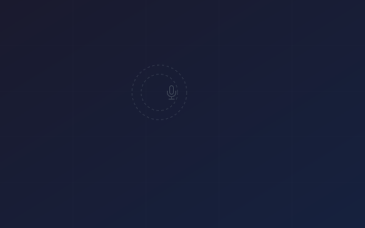

# Voice Aura — Asset & Resource Guidelines

> A complete reference for icons, illustrations, patterns, fonts, and visual assets used in the Voice Aura design system — including where to source them, how to prepare them, and when to use each type.

---

## Table of Contents

1. [Asset Acquisition Policy](#asset-acquisition-policy)
2. [Asset Directory Structure](#asset-directory-structure)
3. [Icons](#icons)
4. [Brand Assets](#brand-assets)
5. [Patterns & Decorative Elements](#patterns--decorative-elements)
6. [Illustrations & Mockups](#illustrations--mockups)
7. [Typography & Fonts](#typography--fonts)
8. [Alternative & Companion Fonts](#alternative--companion-fonts)
9. [Open-Source Platforms & Sources](#open-source-platforms--sources)
10. [Asset Sourcing Workflow](#asset-sourcing-workflow)
11. [File Format & Optimization Guidelines](#file-format--optimization-guidelines)
12. [SVGO Configuration](#svgo-configuration)
13. [Naming Conventions](#naming-conventions)
14. [Color Application for Assets](#color-application-for-assets)
15. [Sizing & Spacing Guidelines](#sizing--spacing-guidelines)
16. [Accessibility](#accessibility)
17. [Performance Considerations](#performance-considerations)
18. [Attribution Registry](#attribution-registry)
19. [Licensing Summary](#licensing-summary)
20. [Dark Mode Asset Guidance](#dark-mode-asset-guidance)
21. [Animated SVG Guidelines](#animated-svg-guidelines)
22. [Stock Photo Integration Patterns](#stock-photo-integration-patterns)
23. [Asset Base Path Configuration](#asset-base-path-configuration)

---

## Asset Acquisition Policy

Before adding **any** external asset to the project, it must pass these gates in order.

### Gate 1 — Do We Already Have It?

Search the existing `assets/` tree first. Run:

```bash
find assets/ -iname '*keyword*'
```

If a suitable asset already exists, **stop here and use it**.

### Gate 2 — License Check

Only the following license families are approved without further review:

| Approved License | Attribution? | Notes |
|------------------|-------------|-------|
| **MIT / ISC** | No | Preferred for icons and code |
| **Apache 2.0** | No | Include NOTICE if redistributing |
| **CC0 / Public Domain** | No | Best for illustrations |
| **SIL Open Font License 1.1** | No (usage) | Fonts only |
| **Unsplash / Pexels / Pixabay** | No | Photos only; no sub-licensing |

These licenses require **team lead approval** before use:

| Conditional License | Attribution? | Action |
|---------------------|-------------|--------|
| **CC BY 4.0** | **Yes** | Add entry to `ATTRIBUTIONS.md` |
| **Freepik Free** | **Yes** | Add entry to `ATTRIBUTIONS.md` |
| **Flaticon Free** | **Yes** | Add entry to `ATTRIBUTIONS.md` |
| **Storyset** | **Yes** | Add entry to `ATTRIBUTIONS.md` |

These licenses are **blocked**:

| Blocked License | Reason |
|-----------------|--------|
| GPL / LGPL | Copyleft may affect project licensing |
| CC BY-NC | No commercial use |
| CC BY-ND | No derivatives |
| No license / unclear | Cannot determine rights |
| "Free for personal use" | Excludes commercial SaaS |

### Gate 3 — Visual Consistency

The asset must match the Voice Aura aesthetic:

- **Icons:** Stroke-based, 24x24 viewBox, 1.5–2px stroke width, `currentColor` fills
- **Illustrations:** Flat or semi-flat style, recolored to VA palette (`#0478FF` accent, `#1A1919` primary)
- **Patterns:** Subtle, low-opacity (0.03–0.08), tileable where possible
- **Photos:** High-contrast, tech/professional subject matter, no watermarks

### Gate 4 — Optimization

Before committing, the asset must be optimized:

- SVG icons: **< 2 KB** (run through SVGO)
- SVG illustrations: **< 50 KB**
- SVG patterns: **< 5 KB**
- Raster images: WebP preferred, **< 200 KB** for hero images
- Remove editor metadata, comments, and unused `<defs>`

### Gate 5 — Documentation

After adding the asset:

1. Save to the correct `assets/` subdirectory
2. Follow [Naming Conventions](#naming-conventions)
3. If attribution is required, add an entry to [`ATTRIBUTIONS.md`](./ATTRIBUTIONS.md)
4. Update this file's directory listing if adding a new category

### Decision Flowchart

```
Need an asset?
│
├─ Already in assets/? ──── YES ──→ Use it. Done.
│
├─ NO → Check license
│       ├─ MIT/CC0/OFL/ISC? ──── YES ──→ Gate 3 (visual check)
│       ├─ CC BY / Freepik Free? ── YES ──→ Get approval → Gate 3 → Add to ATTRIBUTIONS.md
│       └─ GPL / NC / ND / None? ── BLOCKED. Find alternative.
│
├─ Passes visual consistency? ── NO ──→ Recolor/resize, or find alternative.
│
├─ Optimized & under budget? ── NO ──→ Run SVGO / compress / simplify.
│
└─ Document & commit. Done.
```

---

## Asset Directory Structure

**85 assets total** across 6 categories:

```
assets/
├── brand/                          # 3 files — Logo variants
│   ├── logo-icon.svg               # Logo mark (sound-wave icon)
│   ├── logo-icon-white.svg         # Logo mark (white, for dark backgrounds)
│   └── logo-full.svg               # Full logo (icon + "Voice Aura" text)
├── icons/                          # 59 files — UI icons
│   ├── lucide/                     # 54 curated Lucide icons (MIT)
│   │   ├── mic.svg
│   │   ├── headphones.svg
│   │   ├── play.svg
│   │   └── ... (54 total)
│   ├── microphone.svg              # Custom voice-specific icons (ISC)
│   ├── pause-circle.svg
│   ├── play-circle.svg
│   ├── volume-high.svg
│   └── waveform.svg
├── images/                         # 4 files — Blog card placeholder images
│   ├── blog-voice-agents.svg       # Blue/purple microphone-themed
│   ├── blog-video-translation.svg  # Teal video-themed
│   ├── blog-voice-design.svg       # Indigo waveform-themed
│   └── blog-voice-cloning.svg      # Orange clone-themed
├── illustrations/                  # 2 files — Device mockups
│   ├── voice-studio-mockup.svg     # Browser/laptop frame (600x400)
│   └── phone-mockup.svg            # Phone frame (280x560)
└── patterns/                       # 14 files — Background textures & decorations
    ├── halftone-dots.svg           # Repeating halftone tile (16x16)
    ├── halftone-wide.svg           # Wide halftone variant
    ├── grid-dots.svg               # Repeating dot grid tile (24x24)
    ├── grid-lines.svg              # Perpendicular grid with radial fade
    ├── circuit-lines.svg           # Tech path lines with blue node dots
    ├── concentric-rings.svg        # Radiating ripple circles
    ├── crosshair.svg               # Corner "+" decoration marks
    ├── diagonal-lines.svg          # 40px diagonal hatching texture
    ├── gradient-radial-soft.svg    # Soft radial gradient blob
    ├── mesh-gradient.svg           # Multi-stop radial gradient blobs
    ├── noise-texture.svg           # Subtle film-grain overlay (feTurbulence)
    ├── sound-wave-hero.svg         # Decorative hero waveform (120x300)
    ├── sound-wave-wide.svg         # Full-width audio amplitude bars
    └── wave-divider.svg            # Horizontal section separator (1440x60)
```

---

## Icons

### Primary Library: Lucide Icons

Lucide is the recommended icon library for Voice Aura. It provides clean, minimal, stroke-based icons that perfectly match the design system aesthetic.

| Property | Detail |
|----------|--------|
| **Library** | [Lucide Icons](https://lucide.dev/) |
| **License** | MIT (free for commercial use, no attribution required) |
| **Style** | Outline / stroke-based |
| **Default Size** | 24x24 viewBox |
| **Stroke Width** | 2px (default), adjustable |
| **Icon Count** | 1,900+ |
| **Installed via** | `npm install lucide-static` (already in devDependencies) |

### Installation & Usage

#### Option A: Direct SVG (Recommended for Static Sites)

Copy SVGs from `assets/icons/lucide/` or from `node_modules/lucide-static/icons/`:

```html
<!-- Inline SVG (best for styling control) -->
<svg class="va-icon" width="24" height="24" viewBox="0 0 24 24"
     fill="none" stroke="currentColor" stroke-width="2"
     stroke-linecap="round" stroke-linejoin="round">
  <path d="M12 2a3 3 0 0 0-3 3v7a3 3 0 0 0 6 0V5a3 3 0 0 0-3-3Z"/>
  <path d="M19 10v2a7 7 0 0 1-14 0v-2"/>
  <line x1="12" y1="19" x2="12" y2="22"/>
</svg>
```

#### Option B: CDN (Quick Prototyping)

```html
<script src="https://unpkg.com/lucide@latest"></script>
<script>lucide.createIcons();</script>

<!-- Then use data attributes -->
<i data-lucide="mic" class="va-icon"></i>
<i data-lucide="headphones" class="va-icon"></i>
<i data-lucide="send" class="va-icon"></i>
```

#### Option C: React / Vue / Svelte

```bash
npm install lucide-react    # React
npm install lucide-vue-next # Vue 3
npm install lucide-svelte   # Svelte
```

```jsx
import { Mic, Headphones, Send, Settings } from 'lucide-react';

<Mic size={24} color="#1A1919" strokeWidth={1.5} />
<Send size={24} color="#0478FF" strokeWidth={1.5} />
```

### Icon Styling Classes

```scss
// Standard icon
.va-icon {
  width: 24px;
  height: 24px;
  stroke: $va-near-black;
  stroke-width: 1.5;
  fill: none;
  flex-shrink: 0;
}

// Size variants
.va-icon--sm { width: 16px; height: 16px; }
.va-icon--lg { width: 32px; height: 32px; }
.va-icon--xl { width: 48px; height: 48px; }

// Color variants
.va-icon--primary { stroke: $va-primary-blue; }
.va-icon--muted   { stroke: $va-muted-text; }
.va-icon--white   { stroke: $va-white; }

// Filled variant (for solid icons)
.va-icon--filled {
  fill: currentColor;
  stroke: none;
}
```

### Curated Icon Map

These 54 Lucide icons are pre-selected for Voice Aura and saved in `assets/icons/lucide/`:

| Category | Icons |
|----------|-------|
| **Audio/Voice** | `mic`, `mic-off`, `headphones`, `volume-2`, `volume-x`, `audio-waveform`, `podcast`, `radio`, `speaker`, `waves` |
| **Playback** | `play`, `pause`, `square` (stop), `circle-play`, `circle-pause` |
| **Navigation** | `menu`, `x`, `search`, `arrow-right`, `chevron-down`, `chevron-right`, `chevron-up`, `external-link` |
| **Actions** | `send`, `upload`, `download`, `copy`, `share-2`, `bookmark`, `log-in`, `log-out` |
| **Content** | `file-text`, `code`, `globe`, `languages`, `video`, `message-square` |
| **Feedback** | `heart`, `star`, `thumbs-up`, `check`, `bell`, `eye`, `eye-off` |
| **Utility** | `settings`, `user`, `lock`, `mail`, `phone`, `clock`, `zap`, `sparkles` |
| **Commerce** | `credit-card`, `shield-check` |
| **Social** | `github`, `twitter` |

### Secondary Library: Phosphor Icons (Optional)

Use Phosphor only when Lucide lacks a specific icon. Phosphor's "Thin" weight best matches Voice Aura.

```bash
npm install @phosphor-icons/web
```

```html
<i class="ph-thin ph-waveform"></i>
```

| Property | Detail |
|----------|--------|
| **Library** | [Phosphor Icons](https://phosphoricons.com/) |
| **License** | MIT |
| **Recommended Weight** | Thin (1px) or Light (1.5px) |
| **Icon Count** | 8,000+ |

---

## Brand Assets

### Logo Mark (`logo-icon.svg`)

The Voice Aura logo mark consists of a circle with concentric sound-wave arcs emanating to the right. It symbolizes voice generation and audio output.

| Property | Value |
|----------|-------|
| **File** | `assets/brand/logo-icon.svg` |
| **ViewBox** | `0 0 48 48` |
| **Primary Color** | `#0478FF` (circle) |
| **Arc Color** | `#1A1919` (arcs with decreasing opacity) |
| **Min Display Size** | 24x24 px |

#### Usage Rules

- **Do** use the logo mark in the navbar at 32x32 or 40x40 px.
- **Do** use the white variant (`logo-icon-white.svg`) on dark backgrounds.
- **Do** maintain at least 8px clear space around the logo mark.
- **Don't** stretch, rotate, or apply effects to the logo.
- **Don't** recolor the logo outside the defined brand colors.

### Full Logo (`logo-full.svg`)

The full logo combines the icon with "Voice Aura" text set in IBM Plex Serif SemiBold. "Voice" is in near-black, "Aura" is in primary blue.

| Property | Value |
|----------|-------|
| **File** | `assets/brand/logo-full.svg` |
| **ViewBox** | `0 0 200 48` |
| **Min Display Width** | 140px |
| **Font** | IBM Plex Serif, 600 weight |

---

## Patterns & Decorative Elements

### Built-In CSS Patterns (No External Files Needed)

The design system includes two SCSS-based decorative patterns. These are generated with pure CSS and require no image assets.

#### 1. Halftone Dot Overlay

Subtle dot pattern that adds texture to sections and hero areas.

```scss
// Apply to any container element
.my-section {
  @include va-halftone-overlay($opacity: 0.06, $color: $va-near-black);
}
```

| Property | Value |
|----------|-------|
| **Mixin** | `va-halftone-overlay()` |
| **Default Opacity** | `0.06` |
| **Dot Size** | 1px radius |
| **Grid Spacing** | 8px |
| **Location** | `scss/abstracts/_mixins.scss` |

#### 2. Animated Sound Wave Bars

Vertical bars that pulse with staggered timing, used in the hero section flanks.

```html
<div class="va-hero__wave va-hero__wave--left">
  <span class="va-hero__wave-bar"></span>
  <span class="va-hero__wave-bar"></span>
  <!-- 8 bars total -->
</div>
```

| Property | Value |
|----------|-------|
| **Bar Width** | 3px |
| **Bar Color** | `#0478FF` |
| **Bar Count** | 8 per side |
| **Animation** | `va-wave-pulse`, 1.4s alternate |
| **Location** | `scss/layout/_hero.scss` |

### SVG Pattern Tiles

For non-CSS contexts (email, static images, exports), use the SVG pattern tiles:

| Pattern | File | Tile Size | Usage |
|---------|------|-----------|-------|
| Halftone Dots | `assets/patterns/halftone-dots.svg` | 16x16 | `background-image` repeat |
| Grid Dots | `assets/patterns/grid-dots.svg` | 24x24 | `background-image` repeat |
| Sound Wave | `assets/patterns/sound-wave-hero.svg` | 120x300 | Hero flanking decoration |
| Wave Divider | `assets/patterns/wave-divider.svg` | 1440x60 | Horizontal section separator |

#### Using SVG Pattern Tiles

```css
/* Repeating halftone background */
.section-textured {
  background-image: url('../assets/patterns/halftone-dots.svg');
  background-repeat: repeat;
  background-size: 16px 16px;
}

/* Section divider */
.section-divider {
  width: 100%;
  height: 60px;
  background-image: url('../assets/patterns/wave-divider.svg');
  background-size: 100% 100%;
  background-repeat: no-repeat;
}
```

---

## Illustrations & Mockups

### Custom Mockups

| Asset | File | ViewBox | Usage |
|-------|------|---------|-------|
| Browser/Laptop Frame | `assets/illustrations/voice-studio-mockup.svg` | `600x400` | Feature sections, demos |
| Phone Frame | `assets/illustrations/phone-mockup.svg` | `280x560` | Mobile app showcase |

#### Usage

```html
<div class="va-feature-row__visual">
  
</div>
```

### Open-Source Illustration Sources

For additional illustrations (feature pages, empty states, onboarding, error pages), use these platforms:

#### 1. unDraw (Recommended)

| Property | Detail |
|----------|--------|
| **URL** | [undraw.co](https://undraw.co/) |
| **License** | CC0 1.0 (Public Domain) |
| **Attribution** | Not required |
| **Commercial Use** | Yes |
| **Format** | SVG, PNG |
| **Color Customization** | Set accent color to `#0478FF` before downloading |

**Best search terms:** `sound`, `audio`, `voice`, `music`, `recording`, `podcast`, `wave`, `broadcast`

**How to use:**
1. Visit undraw.co
2. Set the accent color to `#0478FF` using the color picker
3. Search for the illustration you need
4. Download as SVG
5. Save to `assets/illustrations/`
6. Edit the SVG to replace any remaining off-brand colors

#### 2. Freepik

| Property | Detail |
|----------|--------|
| **URL** | [freepik.com](https://www.freepik.com/) |
| **License** | Free tier requires attribution; Premium tier does not |
| **Attribution** | **Required for free assets** — add to footer or credits page |
| **Commercial Use** | Yes (both free and premium) |
| **Format** | SVG, AI, EPS, PNG, PSD |
| **Best For** | Polished illustrations, flat vectors, background patterns, stock photos |

**Best search terms:** `audio waveform flat`, `voice assistant minimal`, `podcast illustration flat`, `sound wave pattern`, `microphone line art`, `speech bubble flat`

**How to use:**
1. Search freepik.com and filter by **Free** and **Vectors** (for SVG/AI)
2. Download the asset and check the license on the download page
3. Open in a vector editor (Figma, Illustrator, or Inkscape)
4. Recolor to Voice Aura palette (see [Color Application](#color-application-for-assets))
5. Export as optimized SVG
6. Save to `assets/illustrations/` or `assets/patterns/`
7. **If free license:** Add attribution (e.g., `Designed by [author] / Freepik`) to your project credits

> **Attribution format for free Freepik assets:**
> ```html
> <!-- In footer or credits page -->
> <a href="https://www.freepik.com">Designed by [AuthorName] / Freepik</a>
> ```

#### 3. Flaticon (by Freepik — Icon-Specific)

| Property | Detail |
|----------|--------|
| **URL** | [flaticon.com](https://www.flaticon.com/) |
| **License** | Free with attribution; Premium without |
| **Attribution** | **Required for free icons** |
| **Commercial Use** | Yes |
| **Format** | SVG, PNG, EPS, PSD |
| **Best For** | Specialized icons not found in Lucide (e.g., language flags, industry-specific icons) |

**When to use Flaticon over Lucide:**
- You need a very specific icon that Lucide/Phosphor lack (e.g., a dubbing icon, a specific flag)
- You need filled/colored icons for marketing pages (not app UI)
- The icon will be used decoratively, not as a core UI element

**How to use:**
1. Search flaticon.com and filter by **Free** and **SVG**
2. Prefer **Outline** or **Linear** style to match Lucide
3. Download SVG and recolor strokes to `#1A1919` or `currentColor`
4. Set stroke-width to `1.5` or `2` to match Lucide consistency
5. Save to `assets/icons/` with a descriptive name
6. Add attribution if using the free license

#### 4. Storyset (by Freepik — Animated Illustrations)

| Property | Detail |
|----------|--------|
| **URL** | [storyset.com](https://storyset.com/) |
| **License** | Free with attribution |
| **Attribution** | Required — link to Storyset |
| **Commercial Use** | Yes |
| **Format** | SVG (static and animated) |
| **Best For** | Onboarding flows, empty states, error pages, marketing pages |

**Best search terms:** `podcast`, `voice`, `audio`, `technology`, `recording`

**How to use:**
1. Search storyset.com and pick a style: **Pana** (soft), **Bro** (bold), or **Amico** (minimal)
2. Customize the primary color to `#0478FF`
3. Toggle layers on/off for simplicity
4. Download static SVG or animated SVG
5. Save to `assets/illustrations/`
6. For animated versions, embed the `<svg>` inline in your HTML

#### 5. SVG Repo

| Property | Detail |
|----------|--------|
| **URL** | [svgrepo.com](https://www.svgrepo.com/) |
| **License** | Varies per asset (CC0, MIT, custom) — check each |
| **Attribution** | Usually not required (verify per asset) |
| **Commercial Use** | Most are free for commercial use |
| **Format** | SVG |

**Best search terms:** `waveform`, `audio`, `microphone`, `equalizer`, `monochrome`, `minimal`

**How to use:**
1. Search and filter by "Monochrome" style
2. Download SVG
3. Recolor paths to use Voice Aura brand colors
4. Save to `assets/illustrations/` or `assets/icons/`

#### 6. Hero Patterns (Background Patterns)

| Property | Detail |
|----------|--------|
| **URL** | [heropatterns.com](https://heropatterns.com/) |
| **License** | Free for personal and commercial use |
| **Attribution** | Not required |
| **Format** | CSS / inline SVG |

**Recommended patterns:** Topography, Wiggle, I Like Food (dot grid), Charlie Brown (diagonal lines)

**How to use:**
1. Choose a pattern on heropatterns.com
2. Set the foreground color to `#1A1919` and opacity to 0.03-0.06
3. Copy the CSS
4. Apply as a background to your section element

#### 7. Heroicons

| Property | Detail |
|----------|--------|
| **URL** | [heroicons.com](https://heroicons.com/) |
| **License** | MIT |
| **Attribution** | Not required |
| **Commercial Use** | Yes |
| **Format** | SVG (Outline, Solid, Mini variants) |
| **Best For** | Clean UI icons with a slightly bolder feel than Lucide |

**When to use Heroicons over Lucide:**
- Only when Lucide and Phosphor lack a specific icon
- Prefer the **Outline** variant (24x24) to match Voice Aura's stroke-based style
- Heroicons use `stroke-width="1.5"` by default, which matches Voice Aura's preferred weight

```bash
npm install @heroicons/react   # React
```

```html
<!-- Direct SVG (outline variant) -->
<svg xmlns="http://www.w3.org/2000/svg" fill="none" viewBox="0 0 24 24"
     stroke-width="1.5" stroke="currentColor" class="va-icon">
  <path stroke-linecap="round" stroke-linejoin="round" d="M..."/>
</svg>
```

#### 8. Tabler Icons

| Property | Detail |
|----------|--------|
| **URL** | [tabler.io/icons](https://tabler.io/icons) |
| **License** | MIT |
| **Attribution** | Not required |
| **Commercial Use** | Yes |
| **Icon Count** | 5,800+ |
| **Format** | SVG |
| **Best For** | Largest MIT-licensed collection; fallback for rare icons |

**When to use:** Only when Lucide, Phosphor, and Heroicons all lack the specific icon you need.

#### 9. OpenPeeps (Hand-Drawn People Illustrations)

| Property | Detail |
|----------|--------|
| **URL** | [openpeeps.com](https://www.openpeeps.com/) |
| **License** | CC0 (Public Domain) |
| **Attribution** | Not required |
| **Commercial Use** | Yes |
| **Format** | SVG, PNG |
| **Best For** | Testimonial sections, team pages, about pages, user avatars |

**How to use:**
1. Download the library from openpeeps.com
2. Mix and match heads, bodies, and accessories in Figma
3. Export as SVG
4. Recolor strokes to `#1A1919` for consistency

#### 10. Haikei (SVG Background Generator)

| Property | Detail |
|----------|--------|
| **URL** | [haikei.app](https://haikei.app/) |
| **License** | Free for commercial use (generated output is yours) |
| **Attribution** | Not required |
| **Commercial Use** | Yes |
| **Format** | SVG, PNG |
| **Best For** | Custom wave dividers, blob shapes, gradient backgrounds, layered patterns |

**Best generators for Voice Aura:** Layered Waves, Blob Scene, Stacked Waves, Low Poly Grid, Circle Scatter

**How to use:**
1. Open haikei.app and choose a generator
2. Set colors to match the VA palette: `#0478FF` (primary), `#1A1919` (dark), `#E9E9EA` (light), `#FFFFFF` (white)
3. Adjust complexity, layers, and randomness
4. Export as SVG
5. Run through SVGO: `svgo --config svgo.config.js input.svg -o assets/patterns/custom-wave.svg`
6. Reference in SCSS:
   ```scss
   .va-section--custom-bg::before {
     background-image: url("#{$va-asset-base-path}/patterns/custom-wave.svg");
   }
   ```

#### 11. Iconoir (Open-Source Icon Library)

| Property | Detail |
|----------|--------|
| **URL** | [iconoir.com](https://iconoir.com/) |
| **License** | MIT |
| **Attribution** | Not required |
| **Commercial Use** | Yes |
| **Icon Count** | 1,500+ |
| **Format** | SVG |
| **Best For** | Clean alternative to Lucide with slightly thicker strokes |

**When to use:** Iconoir icons have a `stroke-width: 1.5` default that matches Voice Aura's preferred weight. Use when Lucide and Phosphor both lack the specific icon.

```bash
npm install iconoir-react   # React
```

#### 12. Blush.design (Customizable Illustration Collections)

| Property | Detail |
|----------|--------|
| **URL** | [blush.design](https://blush.design/) |
| **License** | Free tier (limited); Pro for commercial use |
| **Attribution** | Required for free tier |
| **Commercial Use** | Yes (Pro recommended for commercial projects) |
| **Format** | PNG, SVG |
| **Best For** | Consistent illustration sets for features, onboarding, error pages |

**Recommended collections:** Open Peeps, Humaaans, Blobs, Fresh Folk

**How to use:**
1. Browse collections on blush.design
2. Customize skin tones, poses, and compositions
3. Export as PNG (free) or SVG (pro)
4. Recolor to VA palette if needed
5. Save to `assets/illustrations/`

#### 13. Open Doodles (Sketchy Illustrations)

| Property | Detail |
|----------|--------|
| **URL** | [opendoodles.com](https://www.opendoodles.com/) |
| **License** | CC0 (Public Domain) |
| **Attribution** | Not required |
| **Commercial Use** | Yes |
| **Format** | SVG, PNG, GIF |
| **Best For** | Playful empty states, 404 pages, onboarding flows |

#### 14. ManyPixels (Free Illustrations)

| Property | Detail |
|----------|--------|
| **URL** | [manypixels.co/gallery](https://www.manypixels.co/gallery) |
| **License** | Free for commercial use |
| **Attribution** | Not required |
| **Commercial Use** | Yes |
| **Format** | SVG, PNG |
| **Best For** | Flat/isometric illustrations for feature sections and marketing pages |

**How to use:**
1. Browse manypixels.co/gallery and filter by "Flat" style
2. Set the accent color to `#0478FF`
3. Download SVG
4. Optimize and save to `assets/illustrations/`

#### 15. Remix Icon (Neutral-Style Icon System)

| Property | Detail |
|----------|--------|
| **URL** | [remixicon.com](https://remixicon.com/) |
| **License** | Apache 2.0 |
| **Attribution** | Not required |
| **Commercial Use** | Yes |
| **Icon Count** | 2,800+ |
| **Format** | SVG |
| **Best For** | Icons with both line and filled variants in one consistent system |

#### 16. Fontsource (Self-Hosted Web Fonts via npm)

| Property | Detail |
|----------|--------|
| **URL** | [fontsource.org](https://fontsource.org/) |
| **License** | Fonts retain their original license (OFL for IBM Plex) |
| **Attribution** | Per font license |
| **Commercial Use** | Yes |
| **Format** | WOFF2, WOFF |
| **Best For** | Self-hosting Google Fonts with npm packages and automatic `@font-face` |

**How to use for IBM Plex:**
```bash
npm install @fontsource/ibm-plex-sans @fontsource/ibm-plex-serif @fontsource/ibm-plex-mono
```

```scss
// Import specific weights only (reduces bundle size)
@import "@fontsource/ibm-plex-sans/400.css";
@import "@fontsource/ibm-plex-sans/500.css";
@import "@fontsource/ibm-plex-sans/600.css";
@import "@fontsource/ibm-plex-sans/700.css";
@import "@fontsource/ibm-plex-serif/600.css";
@import "@fontsource/ibm-plex-serif/700.css";
@import "@fontsource/ibm-plex-mono/400.css";
```

**Advantages over Google Fonts CDN:**
- No external network requests (faster initial load, GDPR-friendly)
- Only load the weights you need
- Works offline and in air-gapped environments

#### 17. SVG Backgrounds (CSS Pattern Generator)

| Property | Detail |
|----------|--------|
| **URL** | [svgbackgrounds.com](https://www.svgbackgrounds.com/) |
| **License** | Free for commercial use |
| **Attribution** | Not required |
| **Commercial Use** | Yes |
| **Format** | CSS (inline SVG data URI) |
| **Best For** | Subtle tileable background patterns as CSS |

**How to use:**
1. Choose a pattern and adjust colors (`#1A1919` foreground, `#FFFFFF` background)
2. Set opacity to 0.03–0.06
3. Copy the CSS `background-image` value
4. Apply in your SCSS as a custom `.va-bg-*` utility

---

## Typography & Fonts

### Font Family: IBM Plex

Voice Aura uses the IBM Plex superfamily exclusively. All weights are available from Google Fonts under the **SIL Open Font License (OFL)**.

| Font | Usage | Weights | Source |
|------|-------|---------|--------|
| **IBM Plex Serif** | Headings, display text | 400, 500, 600, 700 | [Google Fonts](https://fonts.google.com/specimen/IBM+Plex+Serif) |
| **IBM Plex Sans** | Body text, UI labels | 300, 400, 500, 600, 700 | [Google Fonts](https://fonts.google.com/specimen/IBM+Plex+Sans) |
| **IBM Plex Mono** | Code blocks, API keys | 400, 500 | [Google Fonts](https://fonts.google.com/specimen/IBM+Plex+Mono) |

### Loading Fonts

#### Option A: Google Fonts CDN (Easiest)

```html
<link rel="preconnect" href="https://fonts.googleapis.com">
<link rel="preconnect" href="https://fonts.gstatic.com" crossorigin>
<link href="https://fonts.googleapis.com/css2?family=IBM+Plex+Mono:wght@400;500&family=IBM+Plex+Sans:wght@300;400;500;600;700&family=IBM+Plex+Serif:wght@400;500;600;700&display=swap" rel="stylesheet">
```

#### Option B: Self-Hosted (Best Performance)

1. Download fonts from [Google Fonts](https://fonts.google.com/) or [github.com/IBM/plex](https://github.com/IBM/plex)
2. Place in `assets/fonts/`
3. Use `@font-face` declarations:

```scss
@font-face {
  font-family: 'IBM Plex Sans';
  src: url('../assets/fonts/IBMPlexSans-Regular.woff2') format('woff2');
  font-weight: 400;
  font-style: normal;
  font-display: swap;
}
```

#### Option C: npm Package

```bash
npm install @ibm/plex
```

```scss
@import '@ibm/plex/scss/ibm-plex';
```

### Font Files Source

| Source | URL | License |
|--------|-----|---------|
| Google Fonts | `fonts.google.com` | SIL Open Font License 1.1 |
| IBM GitHub Repo | `github.com/IBM/plex` | SIL Open Font License 1.1 |
| npm | `@ibm/plex` | SIL Open Font License 1.1 |

### Font Usage Rules

- **Headings (h1–h4):** IBM Plex Serif, SemiBold (600) or Bold (700)
- **Subheadings (h5–h6):** IBM Plex Sans, SemiBold (600)
- **Body text:** IBM Plex Sans, Regular (400)
- **Buttons & labels:** IBM Plex Sans, Medium (500) or SemiBold (600)
- **Code snippets:** IBM Plex Mono, Regular (400)
- **Never** mix other typefaces into the Voice Aura design system.

---

## Alternative & Companion Fonts

IBM Plex is the canonical Voice Aura typeface. The alternatives below are documented for teams that need to adapt the design system for sub-brands, partner pages, or future rebranding considerations. **Do not mix these into the core Voice Aura product without a design review.**

All fonts listed below use the **SIL Open Font License 1.1** — free for commercial use, no attribution required.

### Body Text Alternatives

| Font | Style | Weights | Google Fonts | Notes |
|------|-------|---------|-------------|-------|
| **Inter** | Geometric sans | 100–900 | [inter](https://fonts.google.com/specimen/Inter) | Most popular SaaS body font; excellent x-height and legibility. Best match for IBM Plex Sans. |
| **DM Sans** | Geometric sans | 100–1000 | [dm-sans](https://fonts.google.com/specimen/DM+Sans) | Clean, minimal; slightly warmer than Inter. Good for friendly UI. |
| **Outfit** | Geometric sans | 100–900 | [outfit](https://fonts.google.com/specimen/Outfit) | Modern, round terminals; more approachable than IBM Plex. |

### Heading Alternatives

| Font | Style | Weights | Google Fonts | Notes |
|------|-------|---------|-------------|-------|
| **Plus Jakarta Sans** | Geometric sans | 200–800 | [plus-jakarta-sans](https://fonts.google.com/specimen/Plus+Jakarta+Sans) | Friendly, modern headings; pairs well with Inter for body. |
| **Space Grotesk** | Geometric sans | 300–700 | [space-grotesk](https://fonts.google.com/specimen/Space+Grotesk) | Tech-forward, distinctive; great for hero display text. |
| **Sora** | Geometric sans | 100–800 | [sora](https://fonts.google.com/specimen/Sora) | Clean geometric with subtle personality. |

### Monospace Alternatives

| Font | Style | Weights | Google Fonts | Notes |
|------|-------|---------|-------------|-------|
| **JetBrains Mono** | Monospace | 100–800 | [jetbrains-mono](https://fonts.google.com/specimen/JetBrains+Mono) | Designed for code readability; ligatures for operators. |
| **Fira Code** | Monospace | 300–700 | [fira-code](https://fonts.google.com/specimen/Fira+Code) | Popular dev font with programming ligatures. |

### Pairing Recommendations

If replacing IBM Plex entirely, use one of these tested pairings:

```
Heading / Body / Mono
─────────────────────
Plus Jakarta Sans / Inter / JetBrains Mono    ← Modern SaaS
Space Grotesk / DM Sans / Fira Code           ← Tech-forward
Sora / Outfit / JetBrains Mono                ← Friendly & clean
```

### How to Swap Fonts

Override the font variables in `scss/abstracts/_variables.scss`:

```scss
// Example: Switch to Inter + Plus Jakarta Sans
$va-font-heading: 'Plus Jakarta Sans', sans-serif;
$va-font-body:    'Inter', -apple-system, BlinkMacSystemFont, 'Segoe UI', sans-serif;
$va-font-mono:    'JetBrains Mono', 'SF Mono', monospace;
```

Then update the Google Fonts `<link>` in your HTML to load the new families.

## Open-Source Platforms & Sources

### Icon Platform Hierarchy

Use these platforms in order of preference when looking for icons:

| Priority | Platform | License | Icon Count | Style Match |
|----------|----------|---------|------------|-------------|
| 1 | **Lucide** | ISC/MIT | 1,900+ | Exact match (primary library) |
| 2 | **Phosphor** | MIT | 9,000+ | Very close (weight variants) |
| 3 | **Iconoir** | MIT | 1,500+ | Very close (stroke-width: 1.5) |
| 4 | **Heroicons** | MIT | 300+ | Close (stroke-width: 1.5) |
| 5 | **Tabler Icons** | MIT | 5,800+ | Good (stroke-width: 2) |
| 6 | **Remix Icon** | Apache 2.0 | 2,800+ | Good (line + filled variants) |
| 7 | **Flaticon** | Free+attribution | Millions | Varies — filter for outline/linear |

### Illustration Platform Hierarchy

| Priority | Platform | License | Best For |
|----------|----------|---------|----------|
| 1 | **unDraw** | CC0 | Feature illustrations, empty states |
| 2 | **ManyPixels** | Free | Flat/isometric illustrations |
| 3 | **OpenPeeps** | CC0 | People illustrations, testimonials |
| 4 | **Open Doodles** | CC0 | Sketchy/playful illustrations |
| 5 | **Storyset** | Free+attribution | Animated illustrations, onboarding |
| 6 | **Freepik** | Free+attribution | Polished vectors, marketing |
| 7 | **Blush** | Free+attribution | Consistent, customizable illustration sets |
| 8 | **SVG Repo** | Varies | Miscellaneous SVG assets |

### Photo & Image Sources

| Platform | License | Best For |
|----------|---------|----------|
| **Unsplash** | Free (custom) | Hero backgrounds, editorial photos |
| **Pexels** | Free (custom) | Alternative stock photos |
| **Pixabay** | Free (custom) | Icons, vectors, and photos |

> All three platforms allow free commercial use without attribution, but crediting the photographer is appreciated.

### Background Pattern & Generator Platforms

| Priority | Platform | License | Best For |
|----------|----------|---------|----------|
| 1 | **Built-in SCSS** | N/A | `va-halftone-overlay()` mixin, `.va-pattern-*` classes |
| 2 | **`assets/patterns/`** | ISC (project) | 14 pre-made SVG tiles and decorations |
| 3 | **[Haikei](https://haikei.app/)** | Free | Custom wave dividers, blobs, layered gradients |
| 4 | **[Hero Patterns](https://heropatterns.com/)** | Free | Tileable CSS dot/line patterns |
| 5 | **[SVG Backgrounds](https://www.svgbackgrounds.com/)** | Free | Data-URI tileable patterns |

### Font Platforms

| Priority | Platform | License | Best For |
|----------|----------|---------|----------|
| 1 | **[Google Fonts CDN](https://fonts.google.com/)** | SIL OFL 1.1 | Quick setup, no build step |
| 2 | **[Fontsource](https://fontsource.org/)** | Per font (OFL) | Self-hosted via npm (best for production, GDPR-friendly) |
| 3 | **[IBM Plex GitHub](https://github.com/IBM/plex)** | SIL OFL 1.1 | Direct WOFF2 file downloads |
| 4 | **`npm install @ibm/plex`** | SIL OFL 1.1 | SCSS `@import` integration |

---

## Asset Sourcing Workflow

Follow this step-by-step process when adding any new asset to the design system:

### Step 1: Check Existing Assets First

```
assets/icons/      → Do we already have this icon?
assets/patterns/   → Do we already have this pattern?
assets/illustrations/ → Do we already have this illustration?
```

### Step 2: Search Primary Sources

Use the [Icon Platform Hierarchy](#icon-platform-hierarchy) or [Illustration Platform Hierarchy](#illustration-platform-hierarchy) above.

### Step 3: Verify the License

Before downloading, confirm the license:

| License Type | Can Use? | Attribution? | Notes |
|--------------|----------|--------------|-------|
| CC0 / Public Domain | Yes | No | Best option |
| MIT / ISC | Yes | No | Include license file if redistributing |
| Apache 2.0 | Yes | No | Include NOTICE file if redistributing |
| SIL OFL 1.1 | Yes (fonts) | No (usage) | Cannot sell font files alone |
| CC BY 4.0 | Yes | **Yes** | Must credit author |
| Freepik Free | Yes | **Yes** | Must link to Freepik |
| GPL | Caution | Yes | May affect project license — avoid if possible |
| No license stated | **No** | — | Do not use without written permission |

### Step 4: Download & Prepare

1. **Download** the asset in SVG format when possible
2. **Open** in a text editor or vector tool
3. **Clean up** the SVG:
   - Remove unnecessary metadata, comments, and editor artifacts
   - Remove `width` and `height` attributes (use `viewBox` instead)
   - Remove inline `style` elements — use classes or attributes
4. **Recolor** to match the Voice Aura palette (see [Color Application](#color-application-for-assets))
5. **Optimize** the SVG (see [File Format & Optimization](#file-format--optimization-guidelines))

### Step 5: Save & Document

1. Save to the correct directory (see [Asset Directory Structure](#asset-directory-structure))
2. Follow [Naming Conventions](#naming-conventions)
3. If the asset requires attribution, add it to the project's attribution file or credits section

### Step 6: Test

1. Verify the asset renders correctly in the browser
2. Check accessibility (alt text, aria-labels)
3. Test at different sizes and on different backgrounds
4. Verify `prefers-reduced-motion` if the asset is animated

---

## File Format & Optimization Guidelines

### Choosing the Right Format

| Format | Use Case | Advantages | Disadvantages |
|--------|----------|------------|---------------|
| **SVG** | Icons, logos, patterns, illustrations | Scalable, small size, CSS-styleable | Complex images can be large |
| **WebP** | Photos, complex images | 25-35% smaller than JPEG | Not editable as vector |
| **PNG** | Screenshots, images needing transparency | Lossless, wide support | Larger file size |
| **JPEG** | Hero backgrounds, large photos | Small file size | No transparency, lossy |
| **AVIF** | Next-gen photo format | 50% smaller than JPEG | Limited browser support |
| **WOFF2** | Web fonts | Best compression for fonts | Font-specific format |

### SVG Optimization

Always optimize SVGs before adding them to the project:

**Using SVGO (recommended):**

```bash
# Install
npm install -g svgo

# Optimize a single file
svgo input.svg -o output.svg

# Optimize all SVGs in a directory
svgo -f assets/icons/ -o assets/icons/

# With custom config (preserve viewBox, remove dimensions)
svgo input.svg -o output.svg --config='{ "plugins": [
  { "name": "removeViewBox", "active": false },
  { "name": "removeDimensions", "active": true }
]}'
```

**Using SVGOMG (browser-based):**
- Visit [jakearchibald.github.io/svgomg/](https://jakearchibald.github.io/svgomg/)
- Paste or upload your SVG
- Toggle options (keep viewBox, remove dimensions, precision 2)
- Download the optimized SVG

### SVG Best Practices

```xml
<!-- Good: Uses viewBox, no fixed dimensions, currentColor -->
<svg xmlns="http://www.w3.org/2000/svg" viewBox="0 0 24 24"
     fill="none" stroke="currentColor" stroke-width="2"
     stroke-linecap="round" stroke-linejoin="round">
  <path d="M12 1a3 3 0 0 0-3 3v8a3 3 0 0 0 6 0V4a3 3 0 0 0-3-3z"/>
</svg>

<!-- Bad: Fixed dimensions, hardcoded colors, inline styles -->
<svg xmlns="http://www.w3.org/2000/svg" width="24" height="24">
  <path style="fill: #000000;" d="M12 1a3 3 0 0 0-3 3v8..."/>
</svg>
```

### Image Optimization

For raster images (photos, screenshots):

```bash
# Convert to WebP (using cwebp)
cwebp -q 80 input.png -o output.webp

# Responsive images in HTML
<picture>
  <source srcset="hero.avif" type="image/avif">
  <source srcset="hero.webp" type="image/webp">
  
</picture>
```

---

## SVGO Configuration

All SVGs added to the project should be optimized with [SVGO](https://github.com/svg/svgo). A project-level configuration is provided so optimizations are consistent.

### Project Config (`svgo.config.js`)

Create this file at the project root if it doesn't exist:

```js
// svgo.config.js
module.exports = {
  multipass: true,
  plugins: [
    'preset-default',
    'removeDimensions',           // Use viewBox only
    { name: 'removeViewBox', active: false },  // Keep viewBox
    { name: 'removeTitle', active: false },    // Keep <title> for a11y
    {
      name: 'sortAttrs',
      params: { xmlnsOrder: 'alphabetical' }
    },
    {
      name: 'removeAttrs',
      params: {
        attrs: ['data-name', 'class'],  // Remove editor artifacts
        elemSeparator: ':',
      }
    },
  ],
};
```

### Usage

```bash
# Install (one-time)
npm install -g svgo

# Optimize a single file
svgo --config svgo.config.js input.svg -o output.svg

# Optimize an entire directory
svgo --config svgo.config.js -f assets/icons/ -o assets/icons/

# Dry-run (show savings without writing)
svgo --config svgo.config.js input.svg --pretty --output=-
```

### Browser-Based Alternative

For quick one-off optimizations, use [SVGOMG](https://jakearchibald.github.io/svgomg/):
1. Upload or paste SVG
2. Enable: Remove dimensions, Merge paths, Round/rewrite paths (precision 2)
3. Disable: Remove viewBox, Remove `<title>`
4. Download optimized file

---

## Naming Conventions

### File Naming Rules

| Asset Type | Pattern | Example |
|------------|---------|---------|
| Lucide icons | `{icon-name}.svg` | `microphone.svg` |
| Custom icons | `{descriptive-name}.svg` | `waveform-pulse.svg` |
| Brand logos | `logo-{variant}.svg` | `logo-horizontal.svg` |
| Patterns | `{pattern-name}.svg` | `halftone-dots.svg` |
| Illustrations | `{scene-description}.svg` | `voice-studio-mockup.svg` |
| Photos | `{subject}-{size}.{ext}` | `hero-background-1200.webp` |

### General Rules

- Use **lowercase** and **kebab-case** (hyphens, not underscores)
- Be **descriptive** — `audio-waveform.svg` not `icon1.svg`
- Include **variant** in the name when applicable — `logo-dark.svg`, `logo-light.svg`
- Do **not** include size in icon names (size is controlled via CSS)
- Do **not** include color in the name (color is applied via CSS)

### Directory Placement

```
assets/
├── brand/           ← Logos, wordmarks, brand marks
├── fonts/           ← Self-hosted font files (WOFF2)
├── icons/
│   ├── lucide/      ← Icons from Lucide library
│   └── (root)       ← Custom icons, third-party icons
├── illustrations/   ← Scene illustrations, mockups, diagrams
└── patterns/        ← Background patterns, textures, dividers
```

---

## Color Application for Assets

### Recoloring Downloaded SVGs

When downloading SVGs from external sources, recolor them to match the Voice Aura palette:

```
Primary accent:     #0478FF  (interactive elements, highlights)
Primary dark:       #1A1919  (outlines, primary fills)
Secondary grey:     #E9E9EA  (subtle fills, borders)
Background alt:     #F7F7F8  (light fills)
Body text:          #4B5563  (secondary text in illustrations)
Muted:              #9CA3AF  (tertiary elements)
White:              #FFFFFF  (backgrounds, negative space)
```

### CSS Recoloring Techniques

```scss
// Method 1: currentColor (best for inline SVGs)
.va-icon {
  color: $va-near-black;
  // SVG uses stroke="currentColor" or fill="currentColor"
}

// Method 2: CSS filter (for  tags)
.va-illustration--monochrome {
  filter: grayscale(100%) brightness(0.1);
}

.va-illustration--blue {
  filter: grayscale(100%) brightness(0.5) sepia(1) hue-rotate(190deg) saturate(5);
}

// Method 3: Direct SVG path editing
// Open the SVG file and replace fill/stroke values:
//   fill="#6c63ff" → fill="#0478FF"
//   fill="#3f3d56" → fill="#1A1919"
```

---

## Sizing & Spacing Guidelines

### Icon Sizes

| Context | Size | Class |
|---------|------|-------|
| Inline with text | 16px | `.va-icon--sm` |
| Buttons, nav items | 20px | `.va-icon` (adjusted) |
| Standard UI | 24px | `.va-icon` (default) |
| Feature highlights | 32px | `.va-icon--lg` |
| Hero / marketing | 48px | `.va-icon--xl` |
| Large decorative | 64px+ | Custom sizing |

### Icon Spacing

- **Inside buttons:** 8px gap between icon and text
- **In lists:** 12px gap between icon and label
- **In nav items:** 8px gap
- **Standalone:** Centered in their container with min 8px padding

### Illustration Sizes

| Context | Max Width | Aspect Ratio |
|---------|-----------|--------------|
| Hero section | 600px | Flexible |
| Feature row visual | 500px | ~3:2 |
| Card illustration | 280px | ~1:1 or ~4:3 |
| Empty state | 240px | ~1:1 |
| Inline decorative | 120px | Flexible |

### Pattern Tile Sizes

| Pattern | Tile Size | Recommended Scale |
|---------|-----------|-------------------|
| Halftone dots | 16x16 | 1x (16px repeat) |
| Grid dots | 24x24 | 1x (24px repeat) |
| Sound wave hero | 120x300 | 1x |
| Wave divider | 1440x60 | `width: 100%` |

---

## Accessibility

### Icon Accessibility

```html
<!-- Decorative icon (hidden from screen readers) -->
<svg class="va-icon" aria-hidden="true" focusable="false">...</svg>

<!-- Meaningful icon (with accessible label) -->
<svg class="va-icon" role="img" aria-label="Microphone">
  <title>Microphone</title>
  ...
</svg>

<!-- Icon button -->
<button class="va-btn" aria-label="Play audio">
  <svg class="va-icon" aria-hidden="true">...</svg>
</button>
```

### Illustration Accessibility

```html
<!-- Decorative illustration -->


<!-- Meaningful illustration -->

```

### Color Contrast

- All icon strokes meet **WCAG AA** contrast ratio (4.5:1 min) against their backgrounds.
- `#1A1919` on `#FFFFFF` = 17.4:1 contrast ratio (AAA)
- `#0478FF` on `#FFFFFF` = 4.6:1 contrast ratio (AA)
- `#9CA3AF` on `#FFFFFF` = 2.9:1 — use only for decorative, non-essential elements.

---

## Performance Considerations

### Icon Loading Strategy

| Method | Best For | Performance |
|--------|----------|-------------|
| **Inline SVG** | Icons that need CSS styling, interactive icons | Best — no HTTP request |
| **SVG sprite** | Pages with many repeated icons | Good — single HTTP request |
| **`` tag** | Decorative illustrations | Good — cacheable, lazy-loadable |
| **CSS `background-image`** | Patterns, textures | Good — cacheable |
| **Icon font** | Not recommended | Poor — loads all icons regardless of usage |

### Lazy Loading

```html
<!-- Lazy-load illustrations below the fold -->


<!-- Eagerly load hero/above-the-fold images -->

```

### Font Loading Performance

```html
<!-- Preconnect to Google Fonts (already in sample.html) -->
<link rel="preconnect" href="https://fonts.googleapis.com">
<link rel="preconnect" href="https://fonts.gstatic.com" crossorigin>

<!-- Use font-display: swap to avoid FOIT (Flash of Invisible Text) -->
```

When self-hosting fonts, use `font-display: swap` in all `@font-face` declarations to ensure text remains visible while fonts load.

### Size Budgets

| Asset Type | Max Size | Notes |
|------------|----------|-------|
| Individual icon SVG | 2 KB | Optimize with SVGO |
| Illustration SVG | 50 KB | Simplify complex paths |
| Pattern SVG | 5 KB | Keep tile-based and simple |
| Hero photo (WebP) | 200 KB | Use responsive `srcset` |
| Total page SVG weight | 100 KB | Inline only what's above the fold |
| Web font (per weight) | 30 KB (WOFF2) | Subset if possible |

---

## Attribution Registry

All third-party assets used in the Voice Aura Design System must be tracked in the **[ATTRIBUTIONS.md](./ATTRIBUTIONS.md)** file. This registry ensures license compliance, simplifies audits, and makes it easy to credit creators.

### When to Add an Entry

Add a row to `ATTRIBUTIONS.md` whenever you:
- Import an icon, illustration, image, or font from an external source
- Use a free-tier asset that requires attribution (Freepik, Flaticon, Storyset)
- Incorporate a snippet or pattern from an open-source project

### Registry Format

Each entry in `ATTRIBUTIONS.md` follows this structure:

| Field | Description |
|-------|-------------|
| **Asset** | File name or pattern (e.g., `icon-*.svg`, `hero-illustration.svg`) |
| **Source** | Where it came from (e.g., Lucide, unDraw, Freepik) |
| **URL** | Direct link to the asset or source page |
| **License** | SPDX identifier or license name (e.g., `MIT`, `ISC`, `CC0-1.0`, `Freepik-Free`) |
| **Attribution?** | `Yes` or `No` — whether credit is legally required |
| **Added** | Date added (`YYYY-MM-DD`) |
| **Added By** | Contributor name or handle |

### Rendering Attribution in Production

For assets that **require** attribution (Freepik free tier, Flaticon free tier, Storyset):

```html
<!-- In the site footer or a dedicated credits page -->
<p class="va-attribution">
  Icons by <a href="https://www.flaticon.com/" title="Flaticon">Flaticon</a> |
  Illustrations by <a href="https://storyset.com/" title="Storyset">Storyset</a>
</p>
```

For assets where attribution is **appreciated but not required** (Unsplash, Pexels, Lucide):
- Include credit in the project README or an internal credits page
- Not required in the UI

### Auditing

Run a periodic audit to ensure every asset in `assets/` has a corresponding entry:

```bash
# List all asset files
find assets/ -type f | sort > /tmp/asset-files.txt

# Compare against ATTRIBUTIONS.md entries
grep -oP '`[^`]+\.(svg|png|jpg|woff2?)`' ATTRIBUTIONS.md | tr -d '`' | sort > /tmp/attributed.txt

# Show un-attributed files
comm -23 /tmp/asset-files.txt /tmp/attributed.txt
```

---

## Licensing Summary

All assets in the Voice Aura design system are open-source or custom-created.

| Asset | License | Attribution Required | Commercial Use |
|-------|---------|---------------------|----------------|
| **Lucide Icons** | ISC/MIT | No | Yes |
| **Phosphor Icons** | MIT | No | Yes |
| **Iconoir** | MIT | No | Yes |
| **Heroicons** | MIT | No | Yes |
| **Tabler Icons** | MIT | No | Yes |
| **Remix Icon** | Apache 2.0 | No | Yes |
| **IBM Plex Fonts** | SIL OFL 1.1 | No (for use); Yes (for redistribution) | Yes |
| **Fontsource** | Per font (OFL for IBM Plex) | Per font license | Yes |
| **unDraw Illustrations** | CC0 1.0 | No | Yes |
| **ManyPixels** | Free (custom) | No | Yes |
| **OpenPeeps** | CC0 | No | Yes |
| **Open Doodles** | CC0 | No | Yes |
| **Haikei** | Free (generated output) | No | Yes |
| **Hero Patterns** | Free (custom) | No | Yes |
| **SVG Backgrounds** | Free (custom) | No | Yes |
| **SVG Repo** | Varies (CC0/MIT) | Check per asset | Most yes |
| **Freepik (free tier)** | Freepik License | **Yes** — link to Freepik | Yes |
| **Freepik (premium)** | Freepik Premium | No | Yes |
| **Flaticon (free tier)** | Flaticon License | **Yes** — link to Flaticon | Yes |
| **Storyset** | Freepik License | **Yes** — link to Storyset | Yes |
| **Blush (free tier)** | Blush License | **Yes** — credit artist | Yes (Pro recommended) |
| **Unsplash** | Unsplash License | No (appreciated) | Yes |
| **Pexels** | Pexels License | No (appreciated) | Yes |
| **Pixabay** | Pixabay License | No (appreciated) | Yes |
| **Custom Brand SVGs** | Part of design system (ISC) | N/A | Yes |

### License Files

When redistributing the design system, include:
- `LICENSE` — ISC license for the design system code
- Credit Lucide in your project's acknowledgments (appreciated but not required)
- IBM Plex OFL license if self-hosting fonts
- Attribution for any Freepik/Flaticon/Storyset free-tier assets used

---

## Dark Mode Asset Guidance

When assets are used in dark-themed sections (`.va-bg-dark-grid`, feature `--dark` panels, auth showcase), they need special treatment to remain visible and on-brand.

### Icons on Dark Backgrounds

```html
<!-- Use the --white color variant -->
<svg class="va-icon va-icon--white" aria-hidden="true" ...><!-- paths --></svg>

<!-- Or let currentColor inherit from the parent's color -->
<div style="color: #fff;">
  <svg class="va-icon" aria-hidden="true" ...>
    <!-- stroke="currentColor" inherits white -->
  </svg>
</div>
```

### Brand Logo on Dark Backgrounds

Use the white logo variant — do **not** apply CSS filters to recolor the standard logo:

```html
<!-- Correct: dedicated white variant -->


<!-- Incorrect: CSS filter on standard logo -->

```

### Illustrations on Dark Backgrounds

When placing illustrations on dark panels:

1. **Prefer SVGs with `currentColor`** — they automatically adapt
2. **For multi-color illustrations:** create a `-dark` variant with lighter fills
3. **For photos:** add a semi-transparent overlay to maintain contrast:

```scss
.va-illustration--on-dark {
  border-radius: $va-radius-lg;
  // Slight brightness boost for dark backgrounds
  filter: brightness(1.05);

  // Alternative: overlay approach
  &--overlay {
    position: relative;
    &::after {
      content: "";
      position: absolute;
      inset: 0;
      background: rgba($va-near-black, 0.15);
      border-radius: inherit;
      pointer-events: none;
    }
  }
}
```

### Patterns on Dark Backgrounds

Built-in dark variants exist for key patterns:

| Light Pattern | Dark Variant | Notes |
|---------------|-------------|-------|
| `.va-pattern-halftone` | `.va-pattern-halftone--dark` | White dots on dark bg |
| `.va-bg-circuit` | — | Already works on dark (blue accent nodes) |
| `.va-bg-dark-grid` | N/A (dark-only) | Grid lines for dark panels |

For custom patterns on dark backgrounds, invert the pattern color:

```scss
.va-pattern-custom--dark::before {
  // Override pattern color for dark sections
  filter: invert(1);
  opacity: 0.04; // Lower opacity on dark — patterns are more visible
}
```

### CSS Custom Properties for Theming

Use the authored `--va-*` custom properties (defined in `_reset.scss`) to make components theme-aware:

```scss
// Theme-aware card that adapts to dark sections
.va-card--adaptive {
  background: var(--va-color-white);
  color: var(--va-color-text);
  border-color: var(--va-color-border);

  .dark-section & {
    --va-color-white: #{$va-near-black};
    --va-color-text: #{$va-white};
    --va-color-border: rgba(255, 255, 255, 0.1);
  }
}
```

---

## Animated SVG Guidelines

### When to Use Animated SVGs

| Context | Animated? | Source |
|---------|-----------|--------|
| Hero section waveform bars | **Yes** — CSS animation | Built-in `.va-waveform-bars` |
| Loading skeleton shimmer | **Yes** — CSS animation | Built-in `.va-skeleton` |
| Onboarding/empty-state illustrations | **Yes** — SVG animation | Storyset, Lottie |
| Feature illustrations | **No** — static preferred | unDraw, Freepik |
| Icons | **No** — CSS transitions only | Lucide (hover/focus states via CSS) |

### Importing Animated SVGs from Storyset

Storyset provides animated SVGs with embedded `<style>` and `<animate>` elements:

```html
<!-- Inline the animated SVG (required for animation to work) -->
<div class="va-illustration va-illustration--animated" role="img"
     aria-label="User setting up voice profile">
  <svg viewBox="0 0 500 500" xmlns="http://www.w3.org/2000/svg">
    <!-- Storyset animated SVG content here -->
  </svg>
</div>
```

### Reduced Motion Support

**All animated assets must respect `prefers-reduced-motion`.** The design system's global rule in `_anim-components.scss` handles CSS animations automatically, but SVG `<animate>` elements need explicit handling:

```scss
// For inline animated SVGs (Storyset, Lottie, custom)
.va-illustration--animated {
  svg animate,
  svg animateTransform,
  svg animateMotion {
    // Animations play normally by default
  }

  @media (prefers-reduced-motion: reduce) {
    svg animate,
    svg animateTransform,
    svg animateMotion {
      // Pause SVG SMIL animations
      animation-play-state: paused !important;
    }

    // For CSS-animated SVGs, the global rule handles it
    svg * {
      animation-duration: 0.01ms !important;
      animation-iteration-count: 1 !important;
    }
  }
}
```

### JavaScript-Based Animation (Lottie)

For complex animations (mascots, onboarding walkthroughs), use [Lottie](https://airbnb.io/lottie/) with a reduced-motion check:

```html
<div id="lottie-animation" class="va-illustration" aria-label="Welcome animation"></div>

<script>
  const prefersReducedMotion = window.matchMedia('(prefers-reduced-motion: reduce)').matches;
  const anim = lottie.loadAnimation({
    container: document.getElementById('lottie-animation'),
    renderer: 'svg',
    loop: !prefersReducedMotion,
    autoplay: !prefersReducedMotion,
    path: 'assets/animations/welcome.json',
  });
  // Show first frame as static fallback when motion is reduced
  if (prefersReducedMotion) anim.goToAndStop(0, true);
</script>
```

### Performance Budget for Animated Assets

| Asset Type | Max Size | Max Duration | Notes |
|------------|----------|-------------|-------|
| Animated SVG (Storyset) | 80 KB | 3s loop | Inline only above-the-fold |
| Lottie JSON | 100 KB | 5s loop | Lazy-load below fold |
| CSS animation | N/A | Match `$va-duration-*` tokens | Use design system timing |
| GIF (avoid) | 200 KB | — | Prefer animated SVG or Lottie |

---

## Stock Photo Integration Patterns

### Responsive Images with Format Fallbacks

Use the `<picture>` element for hero images and editorial photos from Unsplash/Pexels:

```html
<!-- Hero background image with AVIF → WebP → JPEG fallback -->
<picture>
  <source srcset="assets/images/hero-bg-1200.avif" type="image/avif">
  <source srcset="assets/images/hero-bg-1200.webp" type="image/webp">
  
</picture>

<!-- Below-the-fold feature photo (lazy loaded) -->
<picture>
  <source srcset="assets/images/feature-studio-800.avif 800w,
                  assets/images/feature-studio-400.avif 400w"
          sizes="(max-width: 768px) 100vw, 50vw"
          type="image/avif">
  <source srcset="assets/images/feature-studio-800.webp 800w,
                  assets/images/feature-studio-400.webp 400w"
          sizes="(max-width: 768px) 100vw, 50vw"
          type="image/webp">
  
</picture>
```

### Photo Styling Classes

```scss
// Full-bleed background photo for sections
.va-section__bg-photo {
  position: absolute;
  inset: 0;
  z-index: $va-z-base;
  object-fit: cover;
  width: 100%;
  height: 100%;

  // Darken for text readability
  &--darken {
    filter: brightness(0.4);
  }

  // Desaturate for subtle background
  &--muted {
    filter: grayscale(50%) brightness(0.6);
  }
}

// Photo card thumbnail
.va-photo-thumb {
  width: 100%;
  aspect-ratio: 16 / 10;
  object-fit: cover;
  border-radius: $va-radius;
  transition: transform $va-duration-base ease-in-out;

  &:hover {
    transform: scale(1.03);
  }
}
```

### Photo Preparation Workflow

When adding a stock photo from Unsplash or Pexels:

1. **Download** the highest resolution available
2. **Crop** to the needed aspect ratio (16:10 for cards, 2:1 for hero, 1:1 for avatars)
3. **Generate responsive sizes:**
   ```bash
   # Using ImageMagick (install via: sudo apt install imagemagick)
   convert input.jpg -resize 1200x600^ -gravity center -extent 1200x600 hero-bg-1200.jpg
   convert input.jpg -resize 800x500^  -gravity center -extent 800x500  feature-800.jpg
   convert input.jpg -resize 400x250^  -gravity center -extent 400x250  feature-400.jpg

   # Convert to WebP
   cwebp -q 82 hero-bg-1200.jpg -o hero-bg-1200.webp
   cwebp -q 82 feature-800.jpg  -o feature-800.webp
   cwebp -q 82 feature-400.jpg  -o feature-400.webp
   ```
4. **Verify** file sizes are under budget (see [Performance Considerations](#performance-considerations))
5. **Add alt text** — describe the image content, not the design purpose
6. **Credit** the photographer in `ATTRIBUTIONS.md` (appreciated but not required for Unsplash/Pexels)

---

## Asset Base Path Configuration

The SCSS variable `$va-asset-base-path` controls where pattern and image assets are resolved from. Override it before importing Voice Aura to match your project's directory structure:

```scss
// Default (assumes scss/ and assets/ are siblings)
$va-asset-base-path: "../../assets";

// Rails with Propshaft (assets served from app/assets/)
$va-asset-base-path: "";

// npm consumer (assets in node_modules)
$va-asset-base-path: "~voice-aura-design-system/assets";

// CDN-hosted assets
$va-asset-base-path: "https://cdn.example.com/va-assets";
```

All background patterns in `_bg-patterns.scss` and `_bg-effects.scss` reference this variable:

```scss
// Pattern classes use the configurable base path
.va-pattern-halftone::before {
  background-image: url("#{$va-asset-base-path}/patterns/halftone-dots.svg");
}
```

---

## In-Application Integration Patterns

This section shows **how to actually use** each asset type within Voice Aura's SCSS component system. For sourcing and preparation, see the platform sections above. This section focuses on the code patterns for integration.

### Icons in Components

#### Buttons with Icons

```html
<!-- Primary button with leading icon -->
<button class="va-btn va-btn--primary va-btn--icon">
  <svg class="va-icon" aria-hidden="true" width="20" height="20" viewBox="0 0 24 24"
       fill="none" stroke="currentColor" stroke-width="2"
       stroke-linecap="round" stroke-linejoin="round">
    <path d="M12 2a3 3 0 0 0-3 3v7a3 3 0 0 0 6 0V5a3 3 0 0 0-3-3Z"/>
    <path d="M19 10v2a7 7 0 0 1-14 0v-2"/>
    <line x1="12" y1="19" x2="12" y2="22"/>
  </svg>
  Start Recording
</button>

<!-- Icon-only button -->
<button class="va-btn va-btn--ghost" aria-label="Settings">
  <svg class="va-icon" aria-hidden="true" width="24" height="24" viewBox="0 0 24 24"
       fill="none" stroke="currentColor" stroke-width="2">
    <!-- settings icon paths -->
  </svg>
</button>
```

```scss
// SCSS: The .va-btn--icon modifier handles icon + text spacing
.va-btn--icon {
  display: inline-flex;
  align-items: center;
  gap: $va-grid-unit; // 8px between icon and text

  .va-icon {
    flex-shrink: 0;
    width: 20px;
    height: 20px;
  }
}
```

#### Icons in Navigation

```html
<nav class="va-navbar">
  <a href="/" class="va-navbar__brand">
    <!-- Brand logo icon from assets/brand/ -->
    
    <span>Voice<strong>Aura</strong></span>
  </a>
  <a href="/features" class="va-navbar__link">
    <!-- Lucide icon inline -->
    <svg class="va-icon va-icon--sm" aria-hidden="true" ...><!-- zap paths --></svg>
    Features
  </a>
</nav>
```

#### Icons in Cards

```html
<div class="va-card">
  <div class="va-card__header">
    <!-- Feature icon: larger, colored -->
    <div class="va-card__icon-wrapper">
      <svg class="va-icon va-icon--lg va-icon--primary" aria-hidden="true"
           width="32" height="32" viewBox="0 0 24 24" ...>
        <!-- icon paths -->
      </svg>
    </div>
    <h3 class="va-card__title">Voice Cloning</h3>
  </div>
</div>
```

```scss
// SCSS: Icon wrapper for feature cards
.va-card__icon-wrapper {
  @include va-flex-center;
  width: $va-grid-unit * 7;  // 56px
  height: $va-grid-unit * 7;
  border-radius: $va-radius;
  background-color: rgba($va-primary-blue, 0.08);
  margin-bottom: $va-grid-unit * 2; // 16px
}
```

### Illustrations in Feature Sections

```html
<section class="va-feature-row">
  <div class="va-feature-row__content">
    <h2>Studio-Quality Voice Generation</h2>
    <p>Generate natural-sounding speech in 50+ languages.</p>
  </div>
  <div class="va-feature-row__visual">
    <!-- Illustration from unDraw, Freepik, or assets/illustrations/ -->
    
  </div>
</section>
```

```scss
// SCSS: Illustration container styling
.va-illustration {
  display: block;
  max-width: 100%;
  height: auto;
  border-radius: $va-radius-lg;

  // Optional: subtle shadow for depth
  &--elevated {
    box-shadow: $va-shadow-card;
  }

  // Optional: constrained sizing for empty states
  &--empty-state {
    max-width: 240px;
    margin: 0 auto;
  }
}
```

#### Adding a New Illustration from Freepik

Step-by-step workflow for bringing a Freepik illustration into a feature section:

1. **Search:** Go to [freepik.com](https://freepik.com), search "voice assistant flat illustration", filter by **Free** + **Vectors**
2. **Download:** Get the SVG/AI file. Note the author name for attribution.
3. **Recolor:** Open in Figma/Inkscape. Replace accent colors with `#0478FF`, dark elements with `#1A1919`, greys with `#E9E9EA`
4. **Optimize:** Run through SVGO:
   ```bash
   svgo --config svgo.config.js downloaded-illustration.svg -o assets/illustrations/voice-assistant.svg
   ```
5. **Verify size:** Must be < 50 KB after optimization
6. **Add to HTML:**
   ```html
   <div class="va-feature-row__visual">
     
   </div>
   ```
7. **Attribute:** Add to `ATTRIBUTIONS.md`:
   ```markdown
   | `voice-assistant.svg` | Freepik Free | **Yes** | Designed by [AuthorName] / Freepik |
   ```
8. **Credit in footer** (required for free tier):
   ```html
   <p class="va-attribution">
     Illustrations by <a href="https://www.freepik.com">Freepik</a>
   </p>
   ```

### Patterns & Backgrounds in Sections

#### Using Built-In CSS Patterns

```html
<!-- Halftone dot overlay (CSS-generated, no asset file needed) -->
<section class="va-pattern-halftone">
  <div class="container">
    <h2>Pricing</h2>
    <!-- section content -->
  </div>
</section>

<!-- SVG pattern from assets/ -->
<section class="va-section va-bg-circuit">
  <div class="container"><!-- content --></div>
</section>
```

#### Adding a New SVG Pattern from Haikei or Hero Patterns

1. **Generate:** Create a wave pattern at [haikei.app](https://haikei.app) with VA colors
2. **Save:** `assets/patterns/layered-wave.svg`
3. **Add SCSS class** in `scss/components/_backgrounds.scss`:

```scss
// New pattern: Layered wave background
.va-bg-layered-wave {
  position: relative;
  overflow: hidden;

  &::before {
    content: "";
    position: absolute;
    inset: 0;
    pointer-events: none;
    z-index: $va-z-base;
    background-image: url("../../assets/patterns/layered-wave.svg");
    background-repeat: no-repeat;
    background-size: 100% auto;
    background-position: center bottom;
    opacity: var(--va-pattern-opacity, 0.06);
  }

  // Ensure content sits above the pattern
  > * {
    position: relative;
    z-index: $va-z-raised;
  }
}
```

4. **Register** the new partial import if it's in a new file (existing `_backgrounds.scss` already covers this)
5. **Use in HTML:**
   ```html
   <section class="va-section va-bg-layered-wave">
     <div class="container"><!-- content --></div>
   </section>
   ```

#### Using Noise/Grain Texture Overlay

```html
<!-- Subtle film-grain effect on a section -->
<section class="va-pattern-noise">
  <div class="container"><!-- content --></div>
</section>
```

The noise texture (`assets/patterns/noise-texture.svg`) uses an SVG `feTurbulence` filter for realistic grain without a large file size.

### Fonts in the Application

#### Standard Font Loading (Google Fonts CDN)

```html
<!-- In <head>, before any other stylesheets -->
<link rel="preconnect" href="https://fonts.googleapis.com">
<link rel="preconnect" href="https://fonts.gstatic.com" crossorigin>
<link href="https://fonts.googleapis.com/css2?family=IBM+Plex+Mono:wght@400;500&family=IBM+Plex+Sans:wght@300;400;500;600;700&family=IBM+Plex+Serif:wght@400;500;600;700&display=swap" rel="stylesheet">
```

#### Self-Hosted via Fontsource (Recommended for Production)

```bash
npm install @fontsource/ibm-plex-sans @fontsource/ibm-plex-serif @fontsource/ibm-plex-mono
```

```scss
// In your SCSS entry point, BEFORE importing voice-aura.scss:
@import "@fontsource/ibm-plex-sans/400.css";
@import "@fontsource/ibm-plex-sans/500.css";
@import "@fontsource/ibm-plex-sans/600.css";
@import "@fontsource/ibm-plex-sans/700.css";
@import "@fontsource/ibm-plex-serif/600.css";
@import "@fontsource/ibm-plex-serif/700.css";
@import "@fontsource/ibm-plex-mono/400.css";
```

#### Font Usage by Component Context

```scss
// Headings — IBM Plex Serif (set via $headings-font-family)
h1, h2, h3, h4, .va-h1, .va-h2, .va-h3, .va-h4 {
  font-family: $headings-font-family; // IBM Plex Serif
}

// Body, buttons, labels — IBM Plex Sans (set via $font-family-base)
body, .va-btn, .va-input, .va-badge {
  font-family: $font-family-base; // IBM Plex Sans
}

// Code blocks — IBM Plex Mono (set via $font-family-monospace)
code, pre, .va-code, .ref-code {
  font-family: $font-family-monospace; // IBM Plex Mono
}
```

### Blog Card Images

```html
<article class="va-blog-card">
  <div class="va-blog-card__image">
    <!-- Custom SVG illustration or photo from Unsplash/Pexels -->
    
  </div>
  <div class="va-blog-card__body">
    <span class="va-blog-card__tag">VOICE AGENTS</span>
    <h3 class="va-blog-card__title">Building Voice Agents with AI</h3>
  </div>
</article>
```

#### Creating a New Blog Card Image

Blog card images follow a specific style: **abstract SVG illustrations** with a single accent color on a tinted background (see `assets/images/blog-*.svg` for reference).

1. **Option A — Custom SVG:** Create a simple abstract composition in Figma using VA brand colors
2. **Option B — Freepik/unDraw:** Download and recolor a flat illustration to fit the blog card aspect ratio (~16:10)
3. **Option C — Unsplash photo:** Download a tech-themed photo, crop to 16:10, convert to WebP:
   ```bash
   cwebp -q 80 -resize 600 375 photo.jpg -o assets/images/blog-new-topic.webp
   ```
4. Save to `assets/images/` following naming convention: `blog-{topic-slug}.{svg|webp}`

---

## Component-to-Asset Mapping

This table shows which design system component uses which asset type, where to source them, and how they're referenced.

### Icons

| Component | Asset Source | Integration Method | Example |
|-----------|-------------|-------------------|---------|
| **Buttons** (`.va-btn--icon`) | Lucide (`assets/icons/lucide/`) | Inline SVG with `class="va-icon"` | Send, play, arrow-right |
| **Navbar** (`.va-navbar`) | Brand (`assets/brand/`) + Lucide | Inline SVG or `` for logo | Logo mark, menu, x |
| **Cards** (`.va-card`) | Lucide or Phosphor | Inline SVG in `.va-card__icon-wrapper` | Feature-specific icons |
| **Pricing** (`.va-pricing-card`) | Lucide | Inline SVG for tier features | check, x, zap |
| **Forms** (`.va-input-card`) | Lucide | Inline SVG inside input groups | search, mic, send |
| **Footer** (`.va-footer`) | Lucide + custom | Inline SVG for social/nav links | github, twitter, mail |
| **Blog cards** (`.va-blog-card`) | Lucide | Inline SVG for action icons | bookmark, share-2, clock |
| **Auth forms** (`.va-auth`) | Lucide | Inline SVG in input addons | lock, mail, user, eye |
| **Trust bar** (`.va-trust-bar`) | Custom SVGs | `` tags for partner logos | Client/partner logos |

### Illustrations

| Component | Asset Source | Integration Method | Example |
|-----------|-------------|-------------------|---------|
| **Feature rows** (`.va-feature-row__visual`) | `assets/illustrations/` or unDraw/Freepik | `` | voice-studio-mockup.svg |
| **Hero section** (`.va-hero`) | `assets/illustrations/` | `` or inline SVG | phone-mockup.svg |
| **Empty states** | unDraw, Open Doodles, ManyPixels | `` | No results, first-time user |
| **Error pages** (404, 500) | unDraw, Storyset | `` centered with error text | Page not found |
| **Onboarding** | Storyset, Blush | `` in step cards | Setup wizard steps |

### Patterns & Backgrounds

| Component | Asset Source | Integration Method | Example |
|-----------|-------------|-------------------|---------|
| **Hero section** | `assets/patterns/halftone-wide.svg` | SCSS `.va-pattern-halftone` class | Halftone dot overlay behind hero |
| **Feature sections** | `assets/patterns/circuit-lines.svg` | SCSS `.va-bg-circuit` class | Tech-themed feature panels |
| **Pricing section** | `assets/patterns/grid-dots.svg` | SCSS `.va-pricing-section__dots` | Subtle dot grid behind pricing |
| **Section dividers** | `assets/patterns/wave-divider.svg` | CSS `background-image` | Between major page sections |
| **Dark panels** | `assets/patterns/grid-lines.svg` | SCSS `.va-bg-dark-grid` | Dark feature/API sections |
| **Auth pages** | Generated via `va-halftone-overlay()` mixin | SCSS mixin on showcase panel | Signup page side panel |
| **Blog section** | `assets/patterns/noise-texture.svg` | SCSS `.va-pattern-noise` | Subtle grain on blog background |
| **Any section** | Haikei, Hero Patterns, SVG Backgrounds | New SCSS class in `_backgrounds.scss` | Custom one-off section backgrounds |

### Fonts

| Component | Font | Weight | SCSS Variable |
|-----------|------|--------|---------------|
| **Hero headlines** (h1) | IBM Plex Serif | Bold (700) | `$headings-font-family` |
| **Section headings** (h2) | IBM Plex Serif | SemiBold (600) | `$headings-font-family` |
| **Subheadings** (h3–h4) | IBM Plex Serif | SemiBold (600) | `$headings-font-family` |
| **Small headings** (h5–h6) | IBM Plex Sans | SemiBold (600) | `$font-family-base` |
| **Body text** | IBM Plex Sans | Regular (400) | `$font-family-base` |
| **Buttons & labels** | IBM Plex Sans | Medium (500) | `$font-family-base` |
| **Navigation links** | IBM Plex Sans | Medium (500) | `$font-family-base` |
| **Badges & tags** | IBM Plex Sans | Medium (500) | `$font-family-base` |
| **Code blocks** | IBM Plex Mono | Regular (400) | `$font-family-monospace` |
| **Form inputs** | IBM Plex Sans | Regular (400) | `$font-family-base` |

### Brand Assets

| Component | Asset | File | Notes |
|-----------|-------|------|-------|
| **Navbar brand** | Logo icon + text | `assets/brand/logo-icon.svg` | 32x32 or 40x40 px |
| **Footer brand** | Full logo | `assets/brand/logo-full.svg` | Min width 140px |
| **Favicon** | Logo icon | `assets/brand/logo-icon.svg` | Referenced as `<link rel="icon">` |
| **Dark backgrounds** | White logo variant | `assets/brand/logo-icon-white.svg` | Use on dark sections/footer |
| **Loading/splash** | Logo icon | `assets/brand/logo-icon.svg` | Centered with pulse animation |

---

## Quick Reference: Finding the Right Asset

| I need... | Where to look |
|-----------|---------------|
| A UI icon (mic, play, settings) | `assets/icons/lucide/` or [lucide.dev](https://lucide.dev/) |
| A rare/specific icon | [Phosphor](https://phosphoricons.com/) → [Iconoir](https://iconoir.com/) → [Heroicons](https://heroicons.com/) → [Tabler](https://tabler.io/icons) → [Remix Icon](https://remixicon.com/) |
| A specialized/decorative icon | [Flaticon](https://www.flaticon.com/) (attribution required for free) |
| The Voice Aura logo | `assets/brand/logo-*.svg` |
| A background texture | `@include va-halftone-overlay()` or `assets/patterns/` |
| A custom wave/blob/gradient BG | [Haikei](https://haikei.app/) → save to `assets/patterns/` |
| A tileable CSS pattern | [Hero Patterns](https://heropatterns.com/) or [SVG Backgrounds](https://www.svgbackgrounds.com/) |
| A section separator | `assets/patterns/wave-divider.svg` |
| A feature illustration | [unDraw](https://undraw.co/) → [ManyPixels](https://www.manypixels.co/gallery) → `assets/illustrations/` |
| An animated illustration | [Storyset](https://storyset.com/) (attribution required) |
| A polished vector illustration | [Freepik](https://www.freepik.com/) (attribution required for free) |
| A consistent illustration set | [Blush](https://blush.design/) (Pro for commercial) |
| People illustrations | [OpenPeeps](https://www.openpeeps.com/) → `assets/illustrations/` |
| Sketchy/playful illustrations | [Open Doodles](https://www.opendoodles.com/) (CC0) |
| A device mockup | `assets/illustrations/*-mockup.svg` |
| Custom audio/voice icon | `assets/icons/waveform.svg`, `microphone.svg`, etc. |
| Self-hosted fonts (npm) | [Fontsource](https://fontsource.org/) — `npm install @fontsource/ibm-plex-sans` |
| Font files (CDN) | Google Fonts CDN or `npm install @ibm/plex` |
| A hero/stock photo | [Unsplash](https://unsplash.com/) or [Pexels](https://www.pexels.com/) |
| How to use an asset in a component | See [In-Application Integration Patterns](#in-application-integration-patterns) |
| Which component uses which asset | See [Component-to-Asset Mapping](#component-to-asset-mapping) |

---

*Part of the Voice Aura Design System. See [DESIGN_SYSTEM.md](./DESIGN_SYSTEM.md) for the full design specification.*
